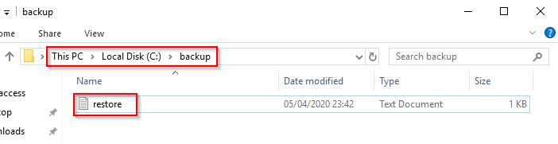
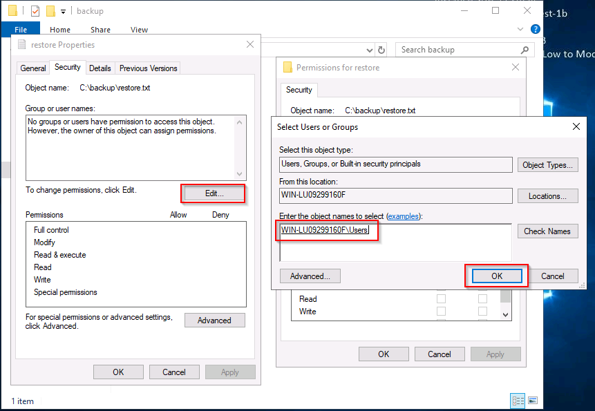

# Anthem

 

## Escaneo de puertos

Realizaremos un análisis inicial de la máquina objetivo utilizando **Nmap** para identificar puertos abiertos y servicios en ejecución.

El análisis con Nmap muestra que los siguientes puertos están abiertos en la máquina objetivo:

- **80/TCP**: Servicio HTTP, alojado en un servidor web IIS.
- **3389/TCP**: Servicio RDP, utilizado para conexiones de escritorio remoto.

Procedemos a investigar el contenido disponible en el puerto **80** para identificar posibles puntos de entrada.

Verificamos la existencia del archivo "*robots.txt"* y confirmamos que está presente en el servidor.

Al revisar el archivo "*robots.txt*", encontramos referencias a rutas restringidas y permitidas para rastreadores. Dentro del archivo, también aparece el texto *"UmbracoIsTheBest!"*, que podría ser una contraseña.

Además, observamos indicios de que el CMS utilizado en la máquina es **Umbraco**, ya que dentro de las rutas bloqueadas se menciona un directorio llamado **/umbraco/**. Con esta información, decidimos acceder a esa ruta para investigar más a fondo y comprobar si la contraseña obtenida es válida.

Al acceder a la ruta, nos recibe una pantalla de autenticación que solicita credenciales. Aunque ya contamos con una posible contraseña, aún nos falta determinar el nombre de usuario, por lo que necesitamos obtener más información.

Explorando el blog del sitio, encontramos un poema. Tras una búsqueda en Google, identificamos que se trata de **Solomon Grundy**. Probamos este nombre como usuario y confirmamos que es válido, logrando acceder al sistema.

Además de las credenciales, necesitamos encontrar el correo electrónico del administrador. Para ello, seguimos investigando en el blog.

Durante la exploración, identificamos una dirección de correo: **JD@anthem.com**. Dado que parece seguir un formato estructurado con las iniciales del nombre, deducimos que el correo asociado a nuestro usuario podría ser **SG@anthem.com**.

 

## Localización de las flags

Muchas de las banderas están ocultas en el código fuente del sitio web. Para localizarlas, inspeccionamos los elementos y revisamos cuidadosamente el contenido de cada página.

**Primera** bandera:

**Segunda** bandera:

**Tercera** bandera:

**Cuarta** bandera:

 

## Pasos finales

Ahora intentamos conectarnos a la máquina a través del puerto **3389** utilizando **RDP** (Remote Desktop Protocol) para establecer una sesión remota.

Para el acceso, utilizamos las credenciales que obtuvimos previamente durante la exploración del sitio web.

Una vez dentro del sistema, exploramos los archivos del usuario y encontramos "*user.txt"*. Al abrirlo, confirmamos que contiene otra bandera.

A continuación, nuestra tarea es localizar la contraseña del usuario **Administrador**. Durante la exploración, encontramos una carpeta de **copia de seguridad** en la unidad **C**, lo que podría ser un indicio de que contiene archivos relevantes para obtener acceso al administrador.

Al intentar acceder al archivo, nos damos cuenta de que no tenemos permisos suficientes. Por lo tanto, procedemos a revisar y modificar la configuración de seguridad:

1.  Hacemos clic derecho sobre el archivo, seleccionamos **Propiedades** y luego vamos a la pestaña de **Seguridad**.
2.  Presionamos **Editar** para modificar los permisos.
3.  Hacemos clic en **Agregar** para añadir un nuevo usuario y tratamos de asignar permisos. Luego, presionamos en **Comprobar nombres** para validar.
4.  Por último, aceptamos y aplicamos los cambios realizados para poder acceder al archivo.  
 

Una vez que modificamos los permisos, logramos abrir el archivo de texto y dentro de él encontramos la **contraseña del Administrador**, lo que nos permite avanzar al siguiente paso en la explotación de la máquina.

Con la contraseña del **Administrador**, iniciamos sesión en la máquina. En su escritorio, descubrimos un archivo llamado "*root.txt"*. Al abrirlo, encontramos la última bandera, completando así nuestro objetivo.

