# Basic Pentesting 

 

## Escaneo de puertos

Iniciamos el proceso con un escaneo mediante **Nmap** con el objetivo de identificar los puertos abiertos y los servicios activos en el sistema objetivo.

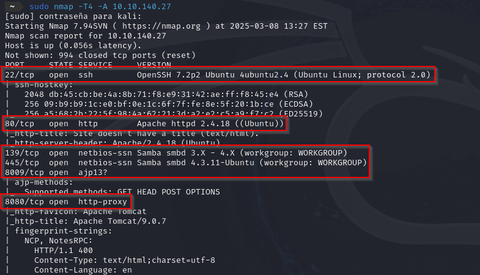

El escaneo revela los siguientes puertos abiertos en la máquina objetivo:

- **22/TCP** (SSH)
- **80/TCP** (HTTP)
- **139/TCP** (SMB)
- **445/TCP** (SMB)
- **8009/TCP** (Apache JServ)
- **8080/TCP** (HTTP)

Procedemos a investigar el puerto **80** a través de nuestro navegador, lo que nos condujo a la siguiente página:

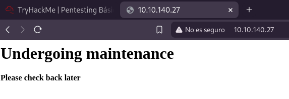

Al explorar el puerto **8080**, encontramos una página distinta a la anterior.

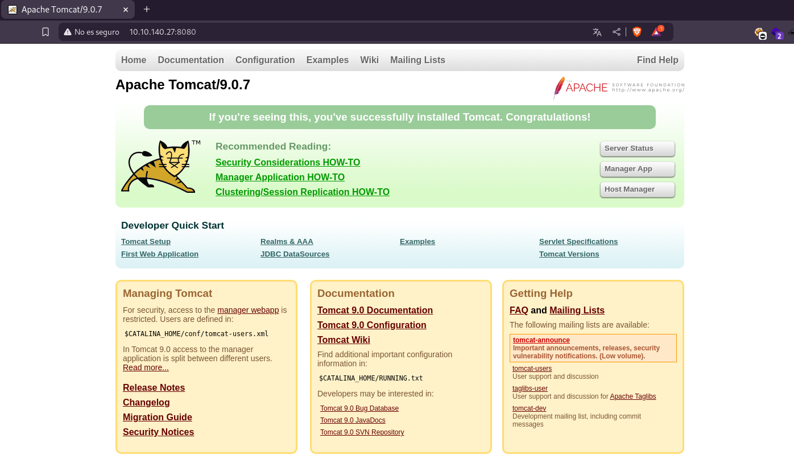

Para identificar posibles directorios ocultos en el sitio web, empleamos la herramienta **Gobuster**.

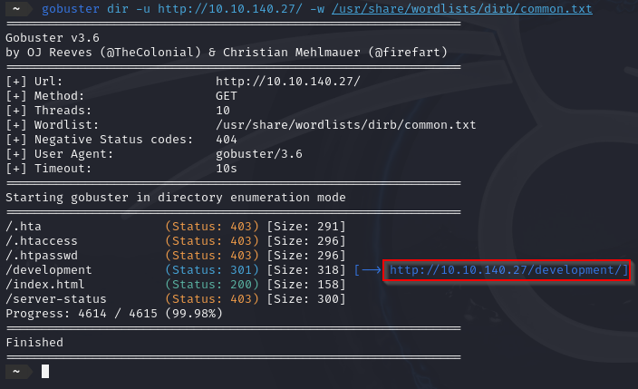

El escaneo revela la presencia de un directorio denominado "*development*". Dentro de este, se identificaron dos archivos: "**dev.txt**" y "**j.txt**".

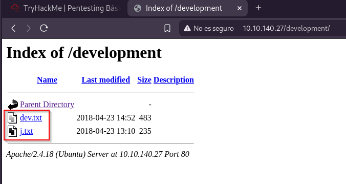

Al revisar el archivo "*dev.txt*", encontramos conversaciones entre los usuarios **\-J** y **\-K**, además de confirmar que la versión de Apache utilizada es la 2.5.12.

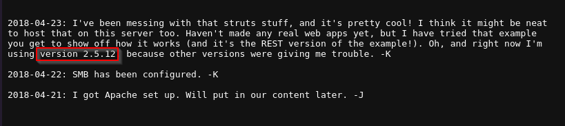

En el archivo "*j.txt*", se menciona que la contraseña del usuario **\-J** es vulnerable, lo que nos proporciona una pista valiosa para continuar con el ataque.

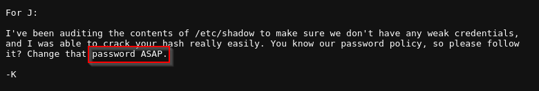

 

## Enumeración y explotación SMB

Con el fin de obtener información adicional sobre el servicio SMB, empleamos un script de **Nmap**.

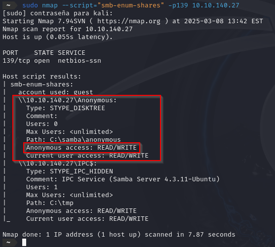

El escaneo identifica un recurso compartido denominado "*/Anonymous*", al cual es posible acceder utilizando el usuario "**anonymous**".

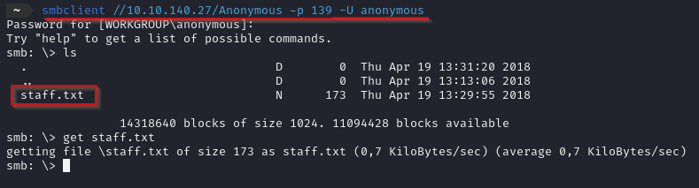

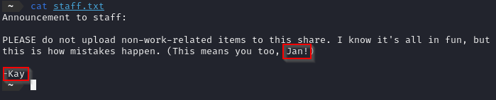

Dentro de este recurso, encontramos referencias a los usuarios **Jan** y **Kay**. Dado que conocemos la debilidad de la contraseña de **Jan**, procedemos a intentar descifrarla utilizando *Hydra*.

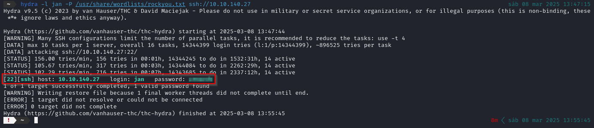

Hydra consigue descifrar la contraseña de Jan, lo que nos permite iniciar una sesión SSH con éxito.  

 

## Escalada de privilegios

Nos conectamos a través de SSH con el usuario **Jan** y, al explorar el sistema, descubrimos que el usuario **Kay** tiene claves RSA accesibles.

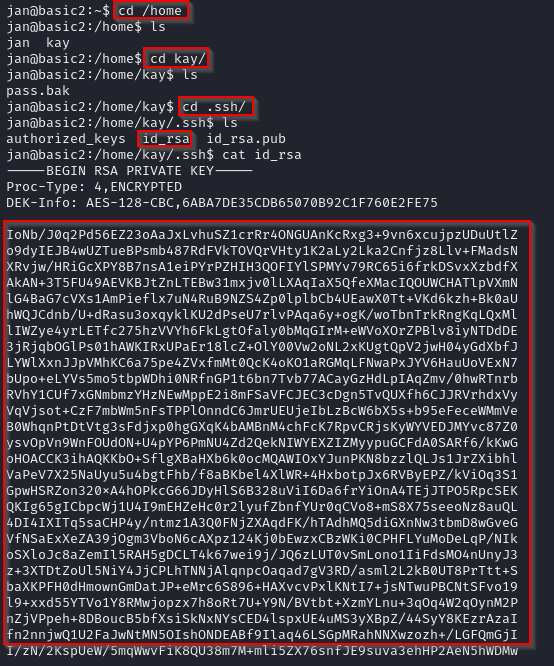

Procedemos a copiar la clave privada y la almacenamos en un archivo denominado "test.txt" en nuestra máquina atacante.

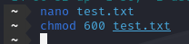

Intentamos establecer la conexión utilizando la clave privada, pero descubrimos que está protegida por una frase de contraseña.

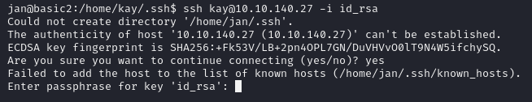

Para descifrar la frase de contraseña, utilizamos **John the Ripper** junto con *ssh2john*. Procedimos a convertir la clave en un hash de la siguiente manera:

A continuación, empleamos John the Ripper junto con el diccionario "*rockyou.txt*" para intentar descifrar la frase de contraseña.

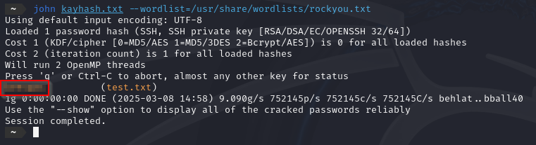

Una vez descifrada la frase de contraseña, logramos conectarnos exitosamente como el usuario **Kay**.

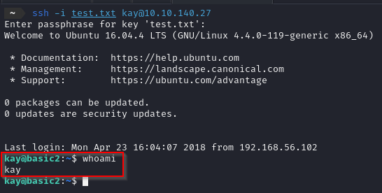

Una vez dentro, localizamos el archivo "*pass.bak*", que contiene la contraseña final.

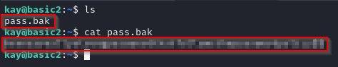