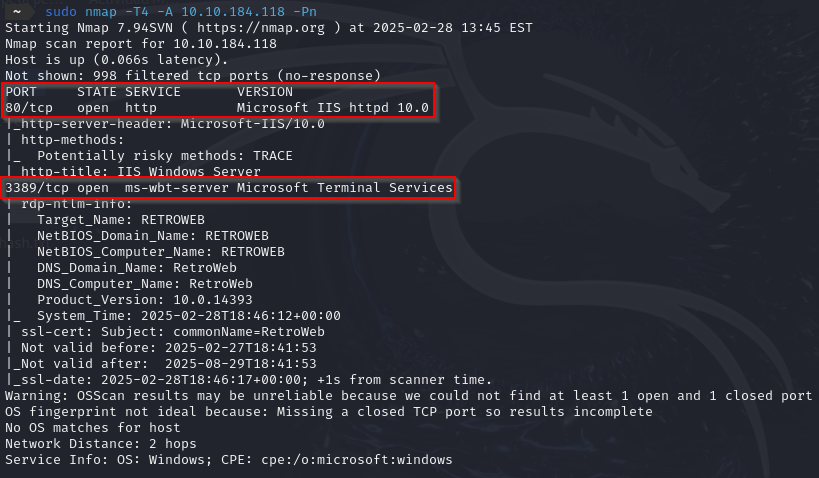
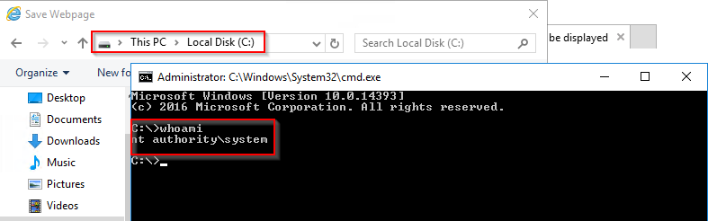
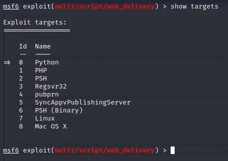

# Blaster

**Blaster** es la última máquina de la trilogía *Blue, Ice & Blaster*. Siguiendo el mismo estilo que las anteriores, el creador proporciona varias pistas durante el proceso de explotación. Este Write-up detalla paso a paso el proceso y escalada de privilegios en el sistema.

 

## Análisis

Comenzamos con un escaneo de puertos utilizando **Nmap** para identificar los servicios activos en la máquina objetivo. Debido a problemas para hacer ping, utilizaremos el parámetro *\-Pn*.

Acceder a la dirección IP a través de un navegador web revela el nombre del sitio.

A continuación, utilizamos la herramienta **Gobuster** para descubrir directorios ocultos en el sitio web. Esta herramienta es fundamental para identificar áreas de la web que no están directamente enlazadas, lo que puede revelar información valiosa.

Al explorar la web, se descubre que la página web fue creada por el usuario "**Wade**."

Navegando por el sitio web, un post sobre *"Ready Player One"* llama la atención. Este post revela la afinidad del usuario Wade por la película y su error recurrente al escribir el nombre del avatar del protagonista al iniciar sesión. Investigando los comentarios de esta publicación, encontramos la **contraseña**.

Con las credenciales en mano, intentamos acceder al sistema utilizando la herramienta **xfreerdp**.

Una vez dentro del sistema, observamos lo siguiente: en el escritorio de la máquina, encontramos un programa llamado *"hhupd"* y un archivo de texto llamado *"user.txt"*. Al examinar el programa *"hhupd",* descubrimos que existe un CVE asociado. Al abrir el archivo *"user.txt"*, obtenemos la primera flag.

 

## Escalada de privilegios

Para escalar privilegios, ejecutamos el programa *"hhupd"* como administrador. Al visualizar el certificado del creador, se abre una página web que genera un error. Es importante guardar esta página después de aceptar la alerta que aparece.

Pasos Detallados:

- Ejecutamos el programa como administrador.
- Abrimos la pestaña *"more details"*.
- Hacemos clic en *"show information about..."*.  

Al hacer clic en el certificado del creador, se abre una página web y, al intentar guardarla, se produce el siguiente error:  

Y lo guardamos usando la siguiente ruta:

Para verificar la escalada de privilegios, abrimos una consola CMD (desde el escritorio o cualquier directorio) y ejecutamos el comando **whoami**. Este comando mostrará que ahora tenemos privilegios de administrador.

Al acceder al escritorio del administrador, encontramos el archivo *"root.txt"*, que contiene la flag final.

 

## Persistencia con metasploit

Para asegurar la persistencia en el sistema, podemos utilizar **Metasploit,** realizaremos una búsqueda del exploit adecuado

Configuración requerida del exploit

Copiamos el comando generado por **Metasploit** y lo ejecutamos en la línea de comandos con privilegios elevados, es decir, en nuestra máquina de windows.

Una vez ejecutado, Metasploit mostrará una consola *Meterpreter*.  

Tradicionalmente, se utilizaba el comando **run persistence** para lograr la persistencia. Sin embargo, este comando está obsoleto y puede generar un error. La alternativa recomendada es utilizar el exploit *exploit/windows/local/persistence*.

Para solucionar este problema, buscamos el exploit persistence en Metasploit.  
Una vez identificado, configuramos la **sesión** que es donde guardamos la sesión de meterpreter del anterior exploit y el **LHOST**.

Y por último, corremos el exploit.

