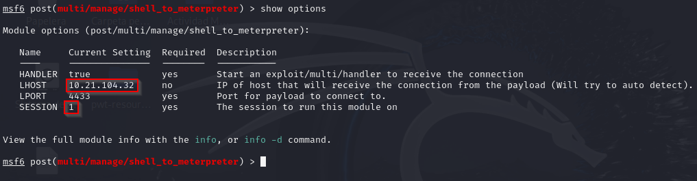

# Blue

Este informe documenta el proceso de explotación de la máquina **Blue** en Tryhackme, abordando la metodología utilizada para la enumeración, explotación, escalada de privilegios y recuperación de información relevante.
 

## Escaneo y enumeración
### Primer Escaneo: Nmap -A -T4
El primer paso para la enumeración de la máquina fue realizar un escaneo completo de puertos y servicios expuestos utilizando **Nmap**. El comando ejecutado fue:

Este primer escaneo reveló los puertos abiertos y los servicios activos en la máquina objetivo, así como el sistema operativo y sus versiones. Entre los resultados más relevantes se encontró que la máquina estaba ejecutando el servicio SMB (Puerto 445).

### Escaneo específico para vulnerabilidades

Se realizó un escaneo más específico para identificar vulnerabilidades en los servicios descubiertos. Utilizando **Nmap** con los siguientes parámetros:

*nmap -sV -sC --script vuln IP*

El parámetro *-sV* identificó las versiones de los servicios en ejecución, mientras que *-sC* ejecutó los scripts predeterminados de **Nmap**, y *--script vuln* permitió identificar posibles vulnerabilidades conocidas. En este caso, el escaneo reveló que la máquina tenía habilitado el protocolo SMBv1 y que estaba vulnerable a la vulnerabilidad **MS17-010** (CVE-2017-0143), también conocida como *"EternalBlue"*, que permite la ejecución remota de código.

 

## Explotación de la vulnerabilidad

Para explotar la vulnerabilidad *MS17-010*, se utilizó **Metasploit**. Tras iniciar la herramienta con msfconsole, se ejecutó la búsqueda del módulo correspondiente con el siguiente comando:

En la siguiente imagen refleja que seleccionamos la vulnerabilidad y realizamos un show options para comprobar que elementos son requeridos:

Agregamos los campos requeridos y los que vamos a utilizar, tanto las ips correspondientes como el playload para abrirnos nuestra máquina reverse.

Y ahora usamos el comando run:  
Al finalizar nos tienen que mostrar la siguiente salida:

La explotación fue exitosa, proporcionando acceso a una sesión remota en la máquina objetivo. Para mantener la sesión activa en segundo plano, se usó *CTRL+Z*, seleccionamos la opción de guardar la sesión.

## Escalada de privilegios

Para mejorar el control sobre la máquina, se convirtió la sesión a Meterpreter utilizando el módulo adecuado. Para esto, primero se realizó la búsqueda del módulo:

Una vez realizado el comando lo seleccionaremos con el comando use (numero identificativo) y luego utilizaremos el comando show options para ver que modulos son requeridos:

Debemos agregar los modulos requeridos, en este caso es requerido la **SESSION**, pero además también deberemos de añadir la *IP de nuestra VPN* para su conexión.

Una vez completado todos los pasos necesarios ya podremos lanzar nuestro comando run y nos sale la siguiente entrada:

Una vez terminado, mostraremos la sessiones que se encuentran en funcionamiento y seleccionaremos la session de nuestra reverse (*meterpreter*)

Si ejecutamos el comando **shell** seguido de *whoami*, la consola nos muestra *NT authority\\system*, lo que indica que hemos accedido y escalado privilegios de forma exitosa en el sistema.

A continuación, se procederá a listar todos los procesos en ejecución utilizando el comando **ps**. El objetivo es identificar un proceso que esté corriendo con privilegios elevados, específicamente bajo el usuario *NT AUTHORITY\SYSTEM*. Este tipo de procesos suelen estar al final de la lista. En nuestro caso, el proceso identificado como **conhost.exe** es el que se utilizará para migrar la sesión.

## Obtención de hashes y cracking

Iniciaremos ejecutando el comando *hashdump*, que nos permitirá ver los hashes de las contraseñas de los usuarios del sistema. Entre ellos, se encuentra el hash del usuario **JON-PC**, que es el que necesitamos obtener.

Luego, se guardará el hash de la contraseña del usuario mencionado en un archivo llamado *hash.txt*, para luego utilizar la herramienta John the Ripper y proceder a crackear el hash.

Una vez que tengamos el hash, lo copiamos en un archivo de texto y lo desciframos con la herramienta **John the Ripper** utilizando el siguiente comando:

## Recuperación de flags

La primera flag se encuentra en el directorio C:\ Al utilizar el comando *cat* sobre el archivo mostrado en la siguiente imagen, podremos visualizar la solución.

Para localizar la segunda flag, utilizaremos el comando *search -f flag2.txt*, el cual nos proporcionará la ruta exacta donde se encuentra.

Y haremos lo mismo que hicimos que con la primera flag utilizando el comando *cat* para visualizarlo:

La tercera y última flag se encuentra en el directorio Documents del usuario **JON-PC**. Para obtenerla, accedemos a esa carpeta y usamos el comando cat nuevamente.

