# Bolt

 

## Escaneo de puertos

El primer paso del análisis consiste en ejecutar un escaneo con **Nmap** sobre la dirección IP de la máquina objetivo. Esto permite identificar los puertos abiertos y obtener información relevante sobre el sistema operativo en uso.

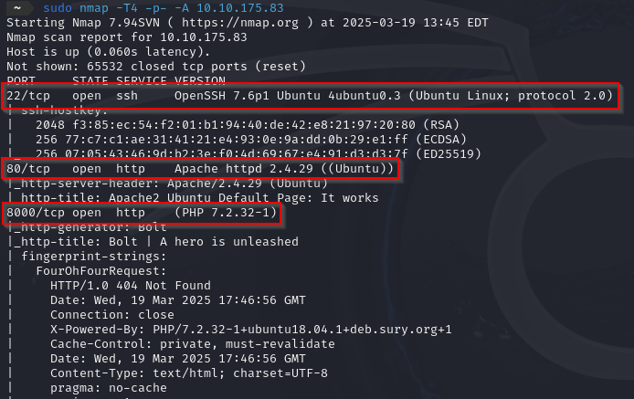

El escaneo ha revelado la presencia de **tres puertos abiertos** en la máquina:

- **22** (SSH)
- **80** (HTTP)
- **8000** (posible aplicación en PHP)  

 

## Investigación de la página

El escaneo identificó **dos puertos abiertos** que ofrecen servicio HTTP: **80** y **8000**. Debido a esto, procederemos a examinarlos para analizar su contenido.

Al acceder al puerto **80**, encontramos la página predeterminada de **Apache**, lo que indica que el servidor web está en funcionamiento pero no presenta contenido adicional visible en este punto.

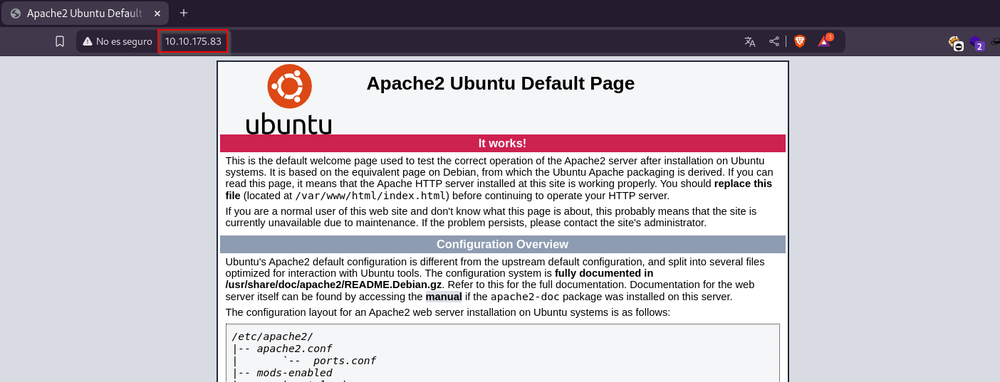

El archivo "*robots.txt***"** y el código fuente de la página en el puerto **80** no revelaron información relevante.

Por ello, procedemos a analizar el puerto **8000**, donde encontramos un sitio basado en **Bolt CMS**.

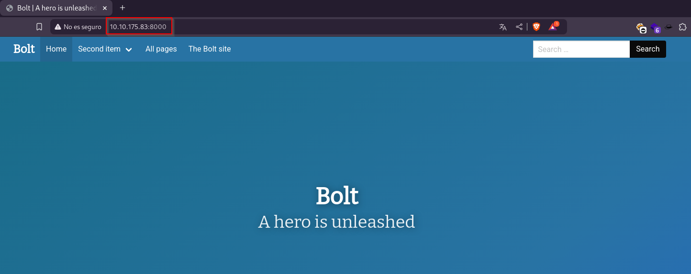

Al analizar el sitio en el puerto **8000**, logramos encontrar credenciales de acceso.

El primer dato relevante que obtenemos es una **contraseña**: **boltadmin123**.

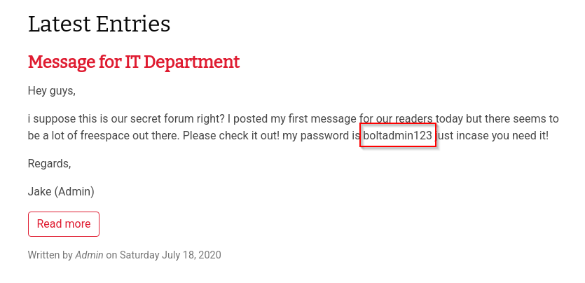

Más adelante, también logramos identificar el **nombre de usuario**, que es: **bolt**.

Al explorar los directorios del sitio, encontramos una página de inicio de sesión accesible a través de **/bolt**.

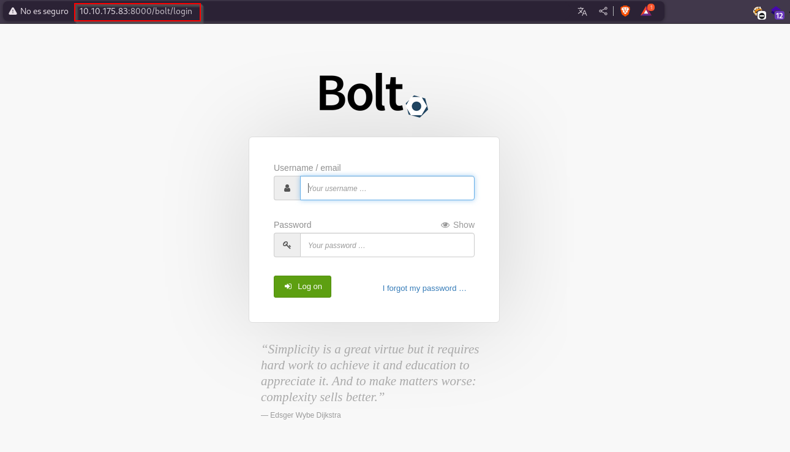

Ingresamos las credenciales encontradas anteriormente (**bolt:boltadmin123**) en la página de inicio de sesión **/bolt** y accedemos correctamente al panel de administración.

Explorando la interfaz, logramos identificar la versión de **Bolt** instalada en el sistema, que es **3.7.1**.

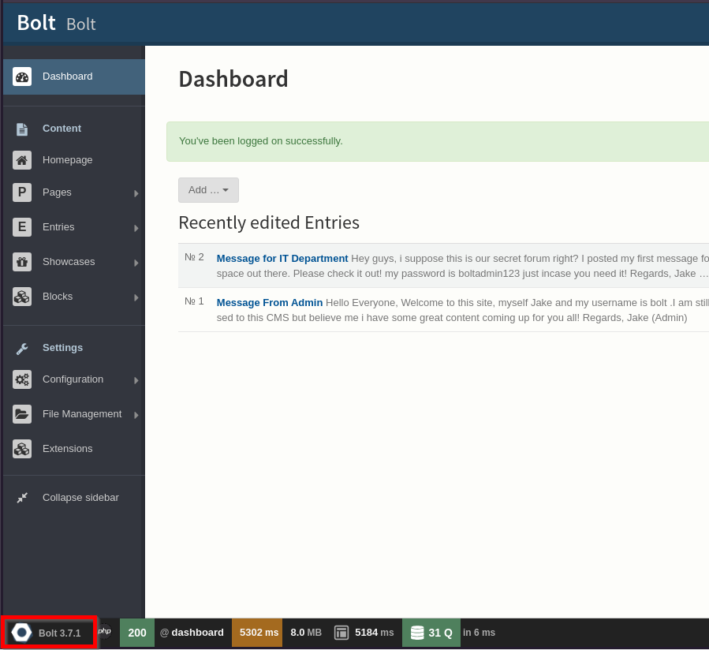

 

## Explotación de vulnerabilidades en la máquina

Con esta información, procedemos a utilizar **Searchsploit** para buscar los exploits disponibles y verificar si existe alguno específico para esta versión.

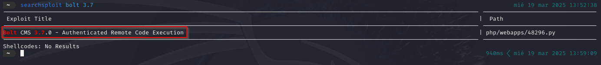

Al realizar la búsqueda, encontramos un exploit disponible para la versión **3.7**. Por lo tanto, utilizaremos **Metasploit** para ejecutar el exploit y aprovechar la vulnerabilidad.

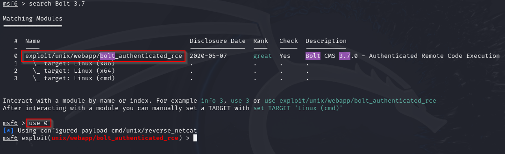

A continuación, ejecutamos el comando **show options** para visualizar los parámetros del exploit que necesitamos configurar antes de proceder con la ejecución.

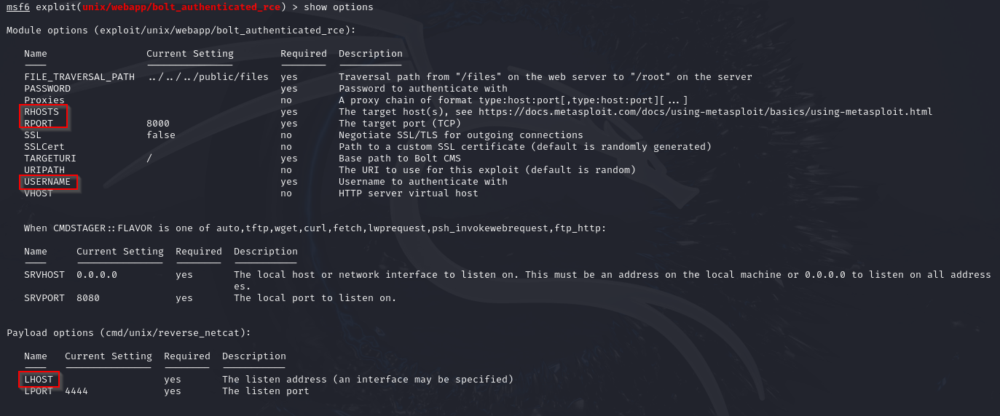

Luego, utilizando el comando **set**, configuramos todos los parámetros necesarios que el exploit requiere para funcionar correctamente.

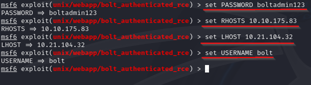

Una vez que todos los parámetros estén configurados correctamente, ejecutamos el comando **run** para lanzar el exploit.

Cuando el exploit se haya cargado con éxito, habremos obtenido acceso a la máquina de la víctima. A partir de ahí, podemos ejecutar comandos como **whoami** para verificar el usuario con el que estamos operando. En este caso, el resultado muestra que estamos utilizando el usuario **root**.

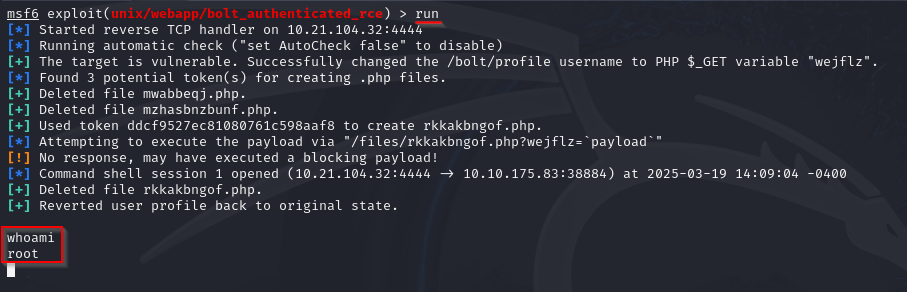

Con acceso al sistema, comenzamos la búsqueda de la **flag**, que en este caso se encuentra en el directorio **/home** del usuario. Para acceder a ella, simplemente ejecutamos el comando **cat flag.txt**, lo que nos permitirá ver la flag de manera clara.

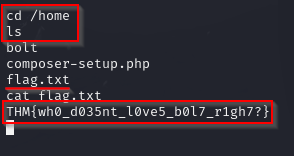