# Bounty Hacker

 

## Escaneo de puertos

Realizaremos un análisis inicial de la máquina objetivo utilizando **Nmap** para identificar puertos abiertos y servicios en ejecución.

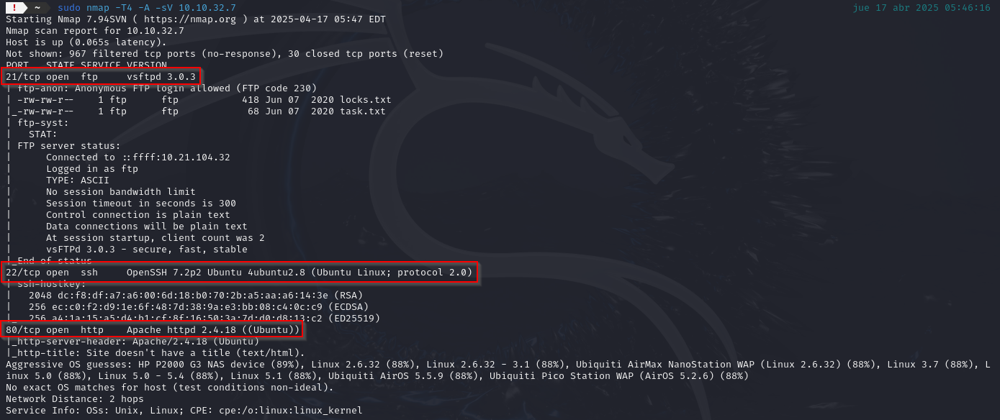

Como podemos observar en la imagen los puertos abiertos son:

- **80/TCP -** HTTP
- **22/TCP -** SSH
- **21/TCP** - FTP  

 

Comenzaremos analizando el sitio web a través del puerto **80**, en busca de información que pueda resultar útil.

El sitio web resultó ser una página estática sin contenido relevante ni enlaces de interés, por lo que procedimos a examinar el siguiente puerto disponible.

Se intentó establecer una conexión con el servidor **FTP** utilizando acceso anónimo.

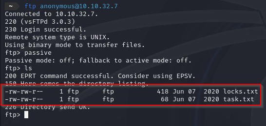

Se identificaron dos archivos que podrían ser relevantes, por lo que procedimos a descargarlos y analizar su contenido para evaluar su posible utilidad.

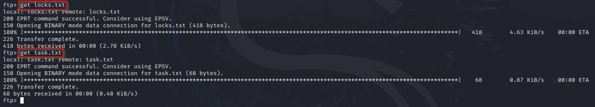

A continuación, se revisaron los archivos `locks.txt` y `task.txt`.

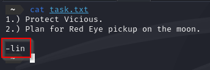

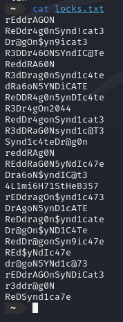

Ahora que tenemos un posible nombre de usuario identificado y el servicio **SSH** accesible a través del puerto **22**, procedimos a realizar un ataque de fuerza bruta utilizando la herramienta `Hydra`, junto con una lista de contraseñas predefinida.

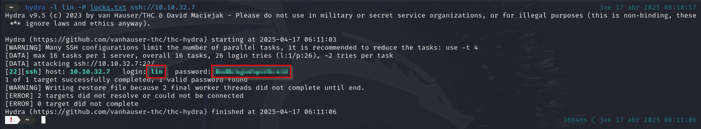

 

## Primera flag

Una vez obtenidas las credenciales, establecemos una conexión **SSH** utilizando dichos datos de acceso.

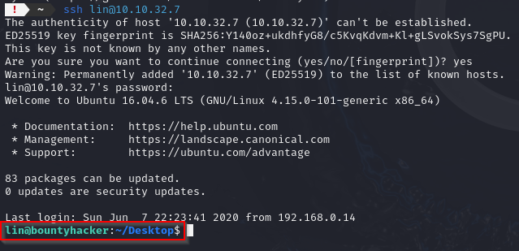

El siguiente paso consiste en localizar la primera **flag** dentro del sistema comprometido.

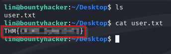

 

## Escalada de privilegios

Para comenzar con la escalada de privilegios, verificamos los permisos del usuario **lin** mediante el comando `sudo -l`.

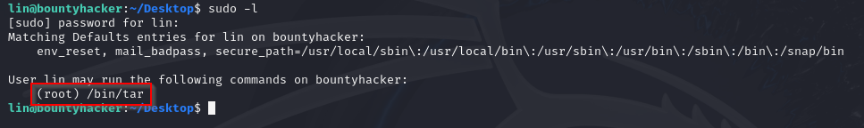

Tal como se muestra en la imagen anterior, el binario `tar` puede ser explotado para obtener acceso como **root**. Consultando la referencia en [GTFOBins](https://gtfobins.github.io/gtfobins/tar/#sudo), identificamos el comando apropiado para llevar a cabo esta acción.

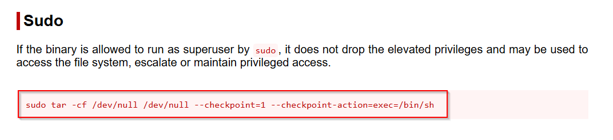

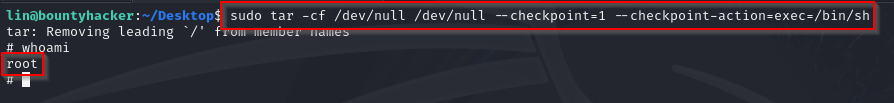

Por último, una vez obtenidos los privilegios de **root**, procederemos a buscar la flag en el sistema.

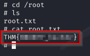