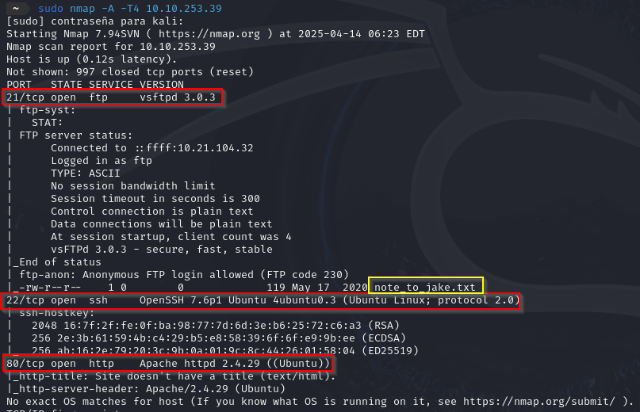
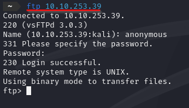
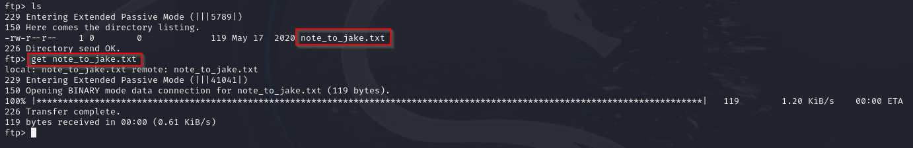
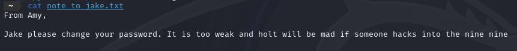
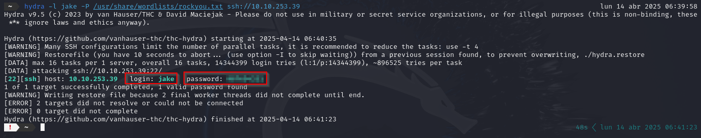
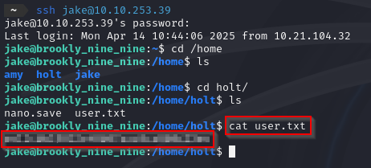
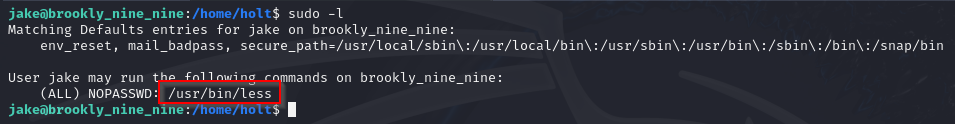
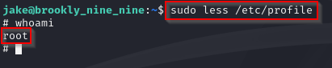
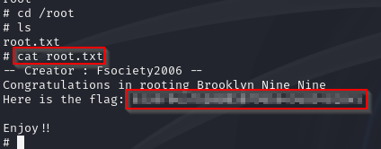

# Brooklyn

## Escaneo de puertos

Iniciamos el proceso con un escaneo mediante **Nmap** con el objetivo de identificar los puertos abiertos y los servicios activos en el sistema objetivo.

Durante el análisis inicial, se identificó el puerto 21 abierto, correspondiente al servicio FTP. Se pudo acceder a él utilizando las credenciales por defecto: usuario y contraseña *anonymous*.

Una vez dentro del servicio FTP, se detectó un archivo llamado *note_to_jake.txt*, el cual fue descargado para su revisión.

Al examinar el contenido del archivo descargado, se encontró un mensaje dirigido al usuario, advirtiéndole sobre la debilidad de su contraseña actual.

 

Dado que el escaneo reveló un puerto abierto asociado al servicio SSH, se procedió a realizar un ataque de fuerza bruta utilizando la herramienta ***Hydra***. Como resultado, se logró obtener las credenciales del usuario *jake*.

Con las credenciales obtenidas, se estableció una conexión SSH exitosa al sistema. Una vez dentro, se exploraron los directorios del sistema hasta localizar la primera flag.

Posteriormente, se verificaron los privilegios del usuario y se observó que tenía permisos de ejecución mediante *sudo* sobre el comando *less*.

Aprovechando esos permisos, se ejecutó `sudo less /etc/profile`, lo que permitió invocar un shell con privilegios elevados al introducir el siguiente comando en el editor:

`!/bin/sh`

Esto concedió acceso a una consola con privilegios de *root*.

Por último, se accedió al directorio del superusuario, donde se encontró el archivo *root.txt*, el cual contenía la segunda flag.

