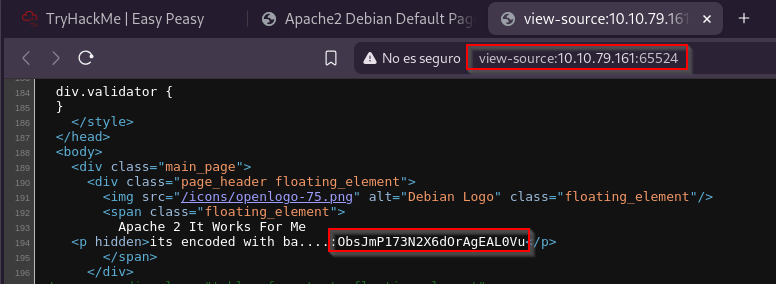

# Easypeasyctf

 

## Escaneo de puertos

Realizaremos un análisis inicial de la máquina objetivo utilizando **Nmap** para identificar puertos abiertos y servicios en ejecución.

Se utiliza la herramienta **Gobuster** para realizar un escaneo y descubrir directorios no visibles en el sistema.

Ingresamos al directorio denominado `/hidden`, sin embargo, no se encuentran elementos de interés.

Realizamos una búsqueda de directorios ocultos dentro del nuevo directorio descubierto.

Exploramos el directorio `/whatever`, donde, al analizar el código fuente, encontramos una cadena codificada en base 64.

Al decodificar la cadena, revelamos la primera flag.

Procedemos a buscar información en el archivo `robots.txt`, detectado mediante el escaneo de Nmap en el puerto **65524**. En su contenido, se encuentra un hash MD5 de una cadena."

Al desencriptar el hash, se obtiene la segunda flag.

Examinamos la página alojada en ese puerto, podemos visualizar la tercera flag.

Revisamos el código fuente y encontramos otra cadena, esta vez codificada en **base 62**.

Desencriptada la cadena, se obtiene la ubicación del directorio oculto.

Exploramos el directorio, aparece una nueva cadena codificada.

Para obtener la contraseña, se emplea la herramienta ***John the Ripper***, utilizando el archivo proporcionado en el ejercicio como apoyo para obtener el resultado.

En el código fuente de la página recientemente analizada, se observa una imagen que podría resultar útil.

Obtenemos la imagen de la página web utilizando el comando `wget`.

Utilizamos la herramienta **Steghide** para extraer el archivo `.txt` oculto dentro de la imagen.

Abrimos el archivo, podemos observar que contiene un usuario y una contraseña en formato binario.

Tras desencriptar el código, se revela la contraseña.

Accedemos al sistema a través de **SSH** utilizando el usuario y la contraseña obtenidos.

En el sistema aparece un archivo llamado `user.txt`, que incluye la flag del usuario, aunque está codificada en **ROT13**.

Una vez descifrada, encontramos la flag.

Dado que el usuario no dispone de permisos **sudo**, se revisa el archivo `/etc/crontab`, donde se encuentra una entrada para el archivo **.mysecretcronjob.sh**, el cual tiene permisos de **root**.

Para configurar una shell reversa, primero se habilita un puerto en escucha en el equipo.

Luego, ejecutamos el siguiente comando en la terminal de la máquina donde se van a escalar los privilegios.

Después de unos segundos, se obtiene acceso a la línea de comandos con privilegios de **root**, donde se ejecutó el comando de escucha.

Por último, al ejecutar el comando **ls -la**, se listan los archivos, entre los cuales se encuentra `root.txt`. Al visualizar su contenido con el comando **cat**, se obtiene la flag.

