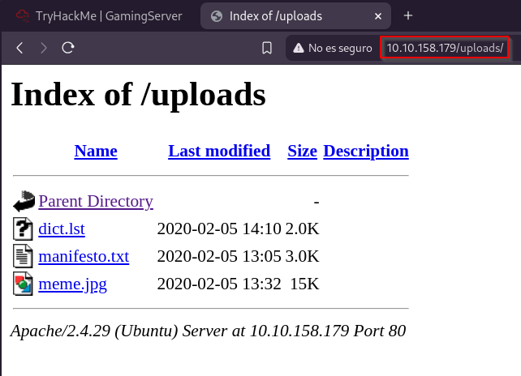
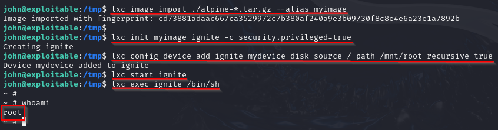

# GammingServer

 

## Escaneo de puertos

Iniciamos el proceso con un escaneo mediante **Nmap** con el objetivo de identificar los puertos abiertos y los servicios activos en el sistema objetivo.

Los puertos encontrados son:

- **22/TCP** - SSH
- **80/TCP** - HTTP

 

## Explotación de la web

Comenzamos la fase de **enumeración inicial** enfocándonos en el servicio **HTTP**. Al acceder a la dirección IP de la máquina a través del navegador, se nos presenta una **página web estándar**, sin ningún contenido evidente que destaque a simple vista.

Como primer paso en la fase de reconocimiento, decidí inspeccionar el **código fuente** de la página web en busca de información oculta que no se muestra directamente en el navegador. Para ello, presioné `Ctrl + U` y revisé el contenido HTML.

Durante esta revisión, encontré un **comentario insertado en el código** que ofrecía una pista útil: mencionaba a un **usuario llamado John**, lo cual podría ser relevante más adelante para el acceso o la enumeración de usuarios en el sistema.

Después de analizar el código fuente, el siguiente paso fue comprobar si el archivo `robots.txt` existía en el servidor web. Este archivo suele contener rutas que el administrador desea ocultar de los motores de búsqueda, pero que pueden revelar información útil durante una auditoría.

En esta ocasión, tuve **suerte**: el archivo `robots.txt` estaba presente y accesible, lo que me permitió continuar con la recolección de rutas potencialmente sensibles dentro del servidor.

Dentro del archivo `robots.txt`, se hacía referencia a una carpeta llamada `/uploads`, por lo que decidí navegar directamente a esa ruta para analizar su contenido.

Al acceder al directorio `/uploads` desde el navegador, observé que contiene **tres archivos**, lo que indica que esta carpeta está expuesta públicamente y podría estar siendo utilizada para almacenar contenido subido por usuarios. Esto representa una posible vía de explotación o análisis más profundo.

Al observar la existencia del directorio `/uploads`, supuse que podría haber **otros directorios ocultos** en el servidor web. Por ello, antes de analizar los archivos encontrados, decidí ejecutar `Gobuster` en segundo plano para realizar un escaneo más amplio y sistemático en busca de rutas adicionales dentro del sitio web.

A continuación, procedimos a examinar los archivos encontrados en el directorio `/uploads`. Uno de ellos, denominado `dict.lst`, llamó especialmente la atención, ya que su nombre sugiere que podría tratarse de un archivo de tipo **lista de contraseñas** o diccionario.

El archivo `manifesto.txt` contiene un simple mensaje del hacker. No parece tener información técnica útil, pero podría ofrecer algo de contexto sobre la máquina o su creador.

El tercer archivo, `meme.jpg`, es simplemente una imagen sin información útil aparente. No parece contener datos ocultos ni metadatos relevantes.

Decidí revisar los resultados del escaneo realizado con **Gobuster** y encontré un directorio llamado `/secret`. Esto podría ser de interés, ya que el nombre sugiere que podría contener información oculta o sensible que podría ayudarnos en el proceso de explotación.

En el directorio **`/secreto`**, encontramos un archivo denominado **`secretkey`**. Al abrirlo, descubrimos que se trata de una **clave privada SSH** encriptada. Esto nos da una pista importante, ya que, con la herramienta adecuada, podríamos descifrarla y usarla para obtener acceso al sistema de forma más directa.

Descargué el archivo `secretkey` a mi equipo local. Dado que está **encriptada**, necesitamos **descifrar la frase de contraseña** utilizando **John the Ripper**.

Para comenzar, debemos convertir la clave privada SSH a un formato de **hash** que **John the Ripper** pueda entender y procesar. Esto se puede lograr utilizando el script `ssh2john`, que extrae el hash de la clave privada para que luego podamos intentar descifrarla con **John the Ripper**.

Guardé el hash generado en un archivo llamado `key.hash` y, a continuación, utilicé **John the Ripper** para intentar descifrarlo.

Una vez que conseguimos las credenciales pudimos conectarnos por el servicio **ssh**.

Una vez dentro conseguimos la primera bandera.

 

## Escalada de privilegios

Mientras investigaba la máquina, descubrí un servicio interesante llamado **LXD (Linux Containers)**, que está **propiedad de root** y es accesible por cualquier usuario. Este servicio puede ser explotado para escalar privilegios, ya que nos permite crear contenedores con privilegios elevados.

Decidí clonar un repositorio de GitHub relacionado con la construcción de contenedores LXD.

Después de clonar el repositorio y construir el contenedor Alpine, el siguiente paso fue **iniciar un servidor web simple** en el contenedor para facilitar la interacción con los archivos o herramientas necesarias.

Después de iniciar el servidor web, procedí a **descargar los archivos** que había clonado localmente en la máquina vulnerada. Utilicé `wget` para transferir los archivos desde el servidor web que había levantado en el contenedor.

Reemplacé `$LHOST` con mi dirección IP local para que el contenedor pueda acceder a los archivos y herramientas necesarios. A continuación, importé la imagen de **Alpine Linux** que había descargado.

Una vez importada la imagen, generé un contenedor con privilegios elevados y configuré un dispositivo de disco.

Con esto, obtuve una **shell** con privilegios de **root** dentro del contenedor.

Una vez que obtuvimos la **shell** con privilegios de **root** dentro del contenedor, recordamos que habíamos montado la carpeta raíz del sistema en `/mnt/root`. Por lo tanto, navegamos hasta este directorio para acceder al archivo `root.txt`, que contiene la **bandera raíz**.

