# Ice

Este Write-up detalla los pasos necesarios para comprometer la máquina "**Ice**" en Tryhackme, basándose en los hallazgos y metodología documentados.

Comenzamos con un escaneo de puertos utilizando **Nmap** para identificar los servicios activos. Esto nos proporciona una visión general de la superficie de ataque potencial y nos confirma el nombre de la máquina.

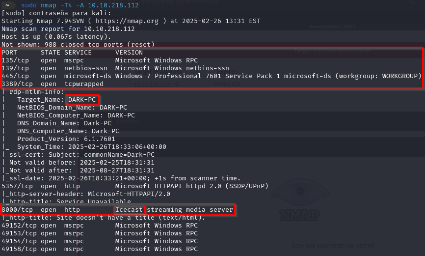

El escaneo revela el puerto **8000**, que ejecuta el servicio **Icecast**. Investigando, encontramos que Icecast está asociado con la vulnerabilidad *CVE-2004-1561*. Esta vulnerabilidad tiene el potencial de ser explotada para obtener acceso al sistema. Aquí podemos encontrar más información acerca de esa vulnerabilidad [CVEdetails](https://www.cvedetails.com/cve/CVE-2004-1561/).

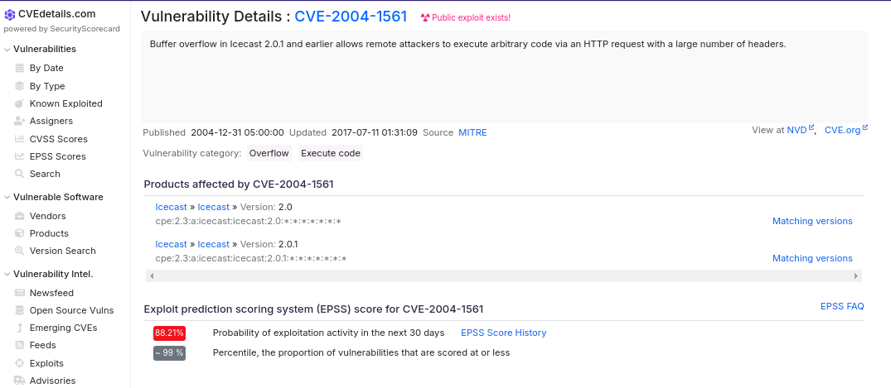

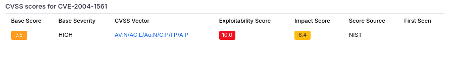

Para explotar esta vulnerabilidad, utilizaremos *Metasploit*. Iniciamos Metasploit con el comando *sudo msfconsole*. Dentro de Metasploit, buscamos exploits relacionados con Icecast.

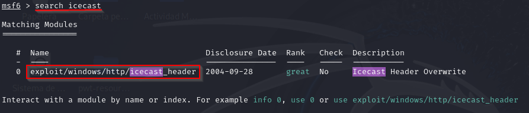

Seleccionamos el exploit listado y examinamos las opciones requeridas. Dos opciones fundamentales son:

- **rhosts**: La dirección IP de la máquina objetivo.
- **lhost**: La dirección IP de tu VPN.

Configuramos estas opciones con los valores apropiados y ejecutamos el exploit utilizando el comando run.

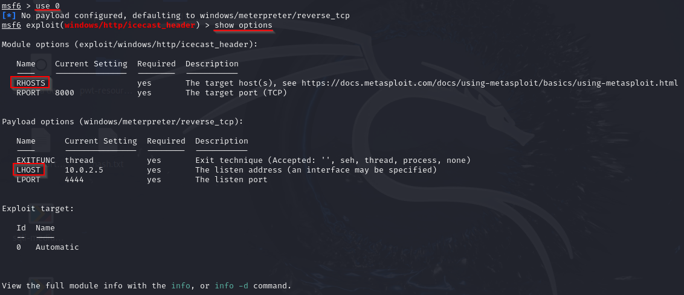

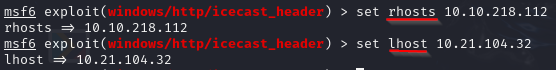

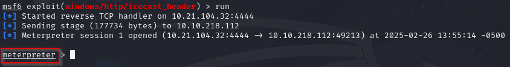

Una explotación exitosa nos proporciona un shell *Meterpreter*. El comando **getuid** nos permite identificar el usuario bajo el cual se está ejecutando el proceso Icecast.

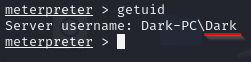

Para obtener una visión más completa del sistema, utilizamos el comando **sysinfo** para obtener detalles sobre el sistema operativo y su arquitectura.

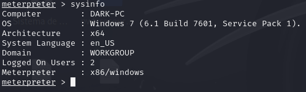

Como parte del proceso de reconocimiento, ejecutamos el script *local_exploit_suggester* recomendado. Este script identifica posibles vulnerabilidades de escalación de privilegios.

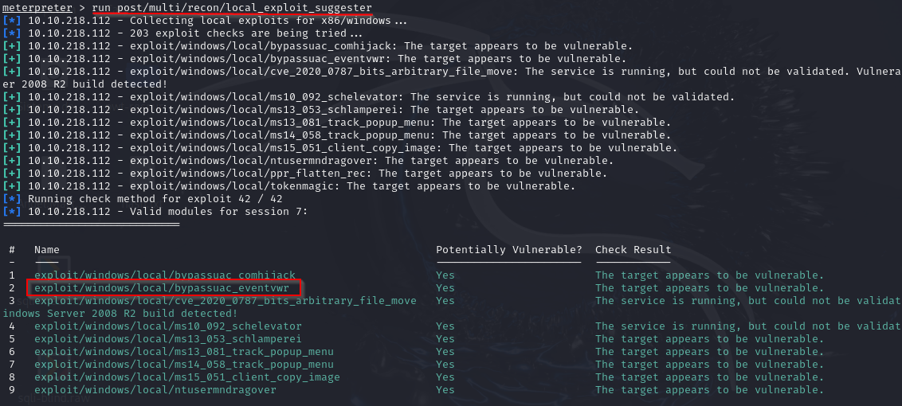

Antes de probar los exploits sugeridos, enviamos la sesión actual a segundo plano usando el comando **background**.  

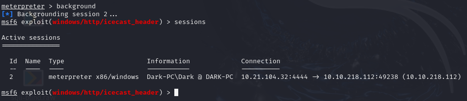

Seleccionamos el exploit sugerido y configuramos las opciones necesarias.

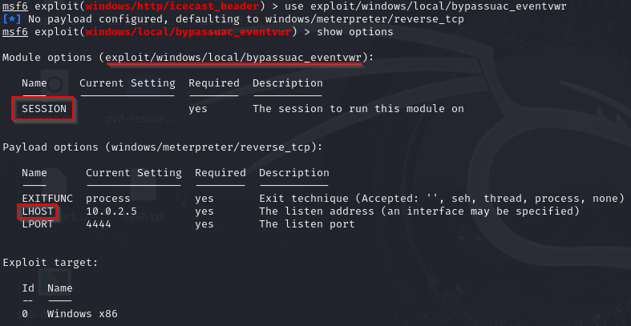

Vamos a realizar las configuraciones necesarias y lo corremos:

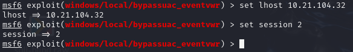

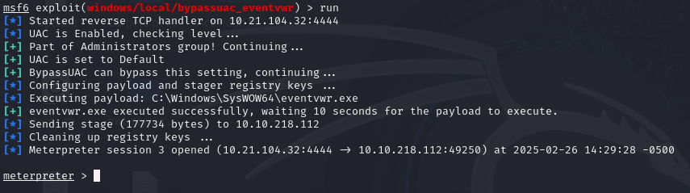

Una vez que este exploit se completa con éxito, obtenemos un nuevo shell. El comando **getprivs** revela los privilegios asociados con el usuario actual. El privilegio que permite tomar posesión de archivos es de particular interés.

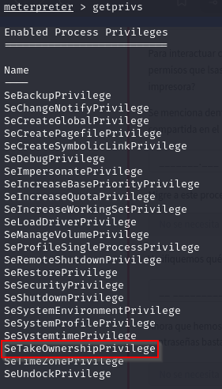

Listamos los procesos en ejecución con el comando **ps** para identificar procesos que podrían ser objetivos para escalación de privilegios.

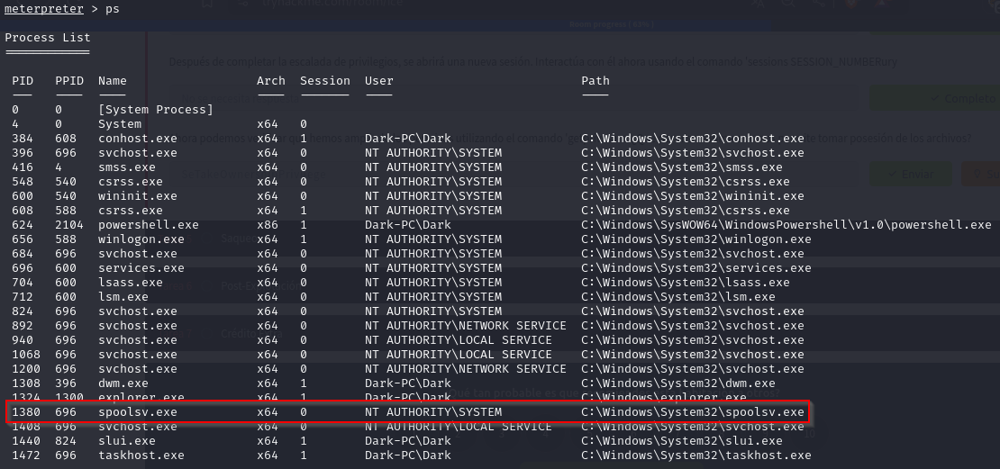

Para continuar escalando privilegios, intentamos asumir el contexto de seguridad del usuario *NT AUTHORITY/SYSTEM*.

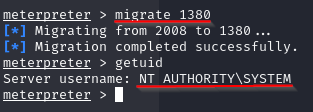

Ahora, operando con privilegios elevados, cargamos la extensión **Kiwi**, una herramienta diseñada para extraer credenciales de la memoria.

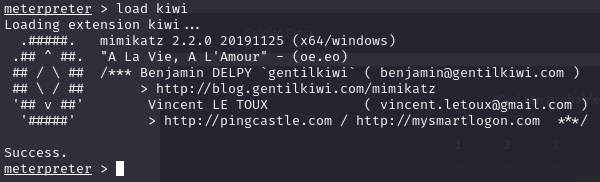

Con Kiwi cargado, podemos ver todos los comandos que se pueden usar con la herramienta con el comando *help*:

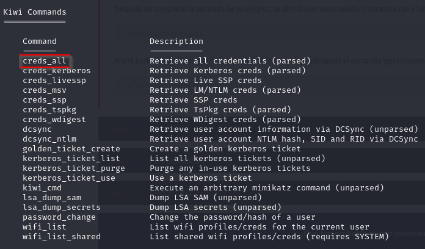        

Extraemos todas las credenciales disponibles usando el comando **creds_all**.

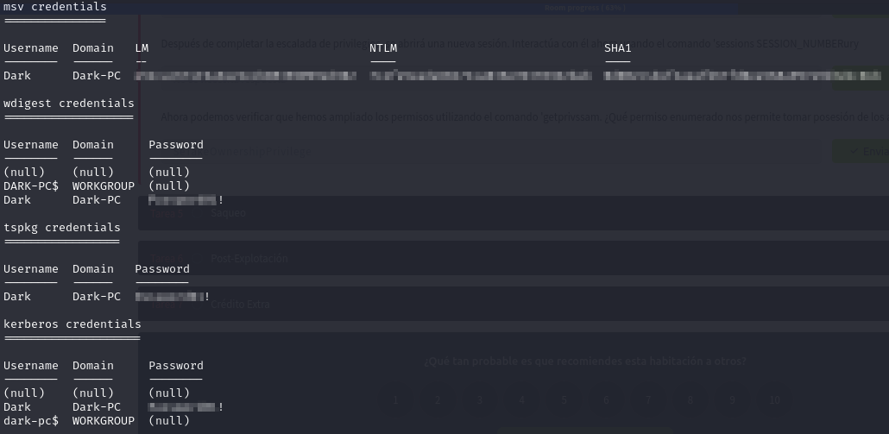

Por último, exploramos algunos comandos útiles para la post-explotación:

**hashdump**: Recupera los hashes de contraseñas del sistema.  

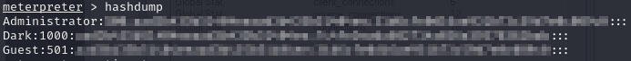

**screenshare**: Permite ver la pantalla del usuario remoto en tiempo real.  

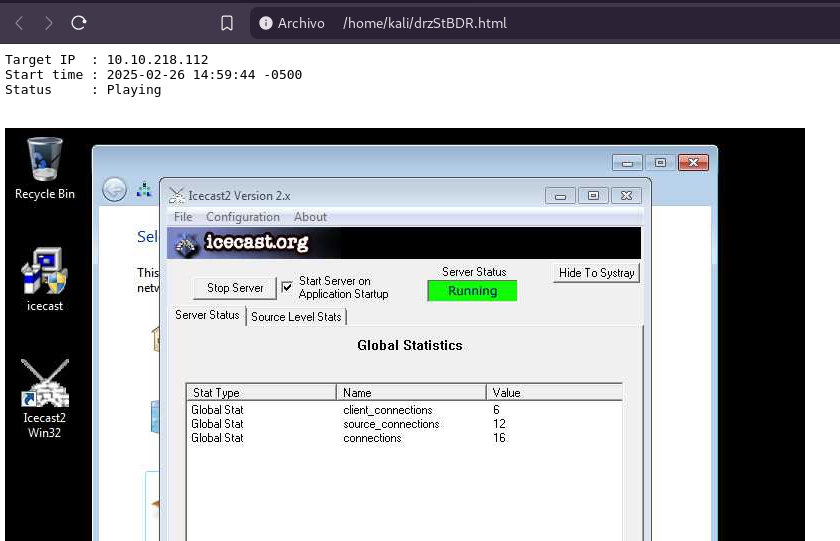

**record_mic**: Graba el audio del micrófono del sistema.

**timestomp**: Modifica las marcas de tiempo de los archivos.

Para moverse lateralmente o autenticarse en otros sistemas, se utiliza un comando específico dentro de *Meterpreter*, facilitando el acceso continuo dentro de la infraestructura comprometida:

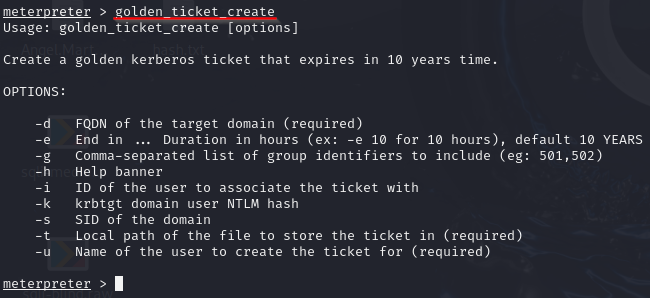