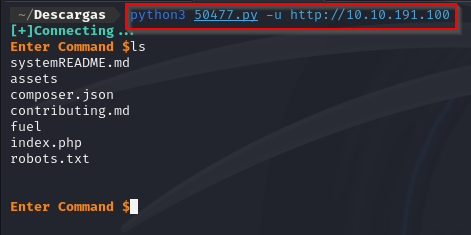
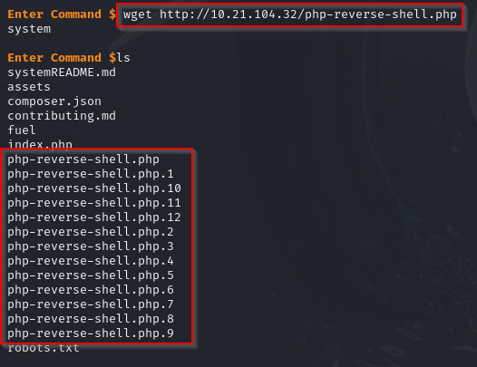
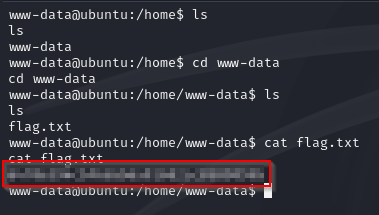

# Ignite

 

## Escaneo de puertos

El primer paso del análisis consiste en ejecutar un escaneo con **Nmap** sobre la dirección IP de la máquina objetivo. Esto permite identificar los puertos abiertos y obtener información relevante sobre el sistema operativo en uso.

Puertos encontrados:

- **80/TCP** - HTTP

 

## Explotación de la web

Accedemos al sitio web alojado en el **puerto 80**, el cual corresponde al servicio HTTP. Este suele ser el punto de entrada principal en muchas máquinas, por lo que comenzamos la enumeración explorando su contenido y funcionalidad.

Desde la página principal de **Fuel CMS**, intentamos acceder al panel de administración utilizando las credenciales por defecto `admin:admin`.

La autenticación es exitosa, lo que nos permite acceder al **panel de control** de Fuel CMS. Desde aquí, evaluaremos las funcionalidades disponibles y posibles vectores de explotación.

Al hacer clic en **"Click here for your site documentation"** dentro del panel de control, se revela la versión del CMS instalada. En este caso, se trata de **Fuel CMS 1.4**, información clave para identificar posibles vulnerabilidades asociadas a esa versión específica.

Tras una rápida búsqueda en Google sobre vulnerabilidades asociadas a esta versión, encontramos un **exploit público para Fuel CMS 1.4.1**. Aunque no es exactamente la misma versión, decidimos descargarlo y analizarlo, ya que podría ser compatible o requerir solo ajustes mínimos para su ejecución.

Procedemos a ejecutar el exploit utilizando el siguiente comando:

Descargamos una **reverse shell en PHP** desde **PentestMonkey**, un recurso ampliamente utilizado durante pruebas de penetración para obtener acceso remoto al sistema a través de una conexión inversa.

Extraemos y editamos el archivo `.php` de la reverse shell, reemplazando la dirección IP y el puerto por los de nuestra máquina atacante, asegurándonos de que la conexión inversa se establezca correctamente.

Levantamos un servidor web en nuestra máquina atacante para alojar la reverse shell, permitiendo que el objetivo la descargue y la ejecute desde su entorno.

Desde el servidor comprometido, procedemos a descargar la **reverse shell** alojada en nuestra máquina atacante, utilizando herramientas disponibles como `wget`.

Antes de ejecutar la reverse shell, configuramos nuestro **puerto de escucha** utilizando **Netcat** para esperar la conexión inversa desde el servidor comprometido.

Ejecutamos la **reverse shell** accediendo al archivo **.php** desde el navegador, lo que provoca que el servidor comprometido inicie la conexión inversa hacia nuestra máquina atacante.

Si todo ha funcionado correctamente, hemos obtenido acceso al sistema remoto con privilegios de `www-data`, el usuario bajo el cual se ejecutan los procesos web en el servidor.

Para mejorar la estabilidad y funcionalidad de la **reverse shell**, ejecutamos el siguiente comando, lo que nos permite tener una sesión más interactiva y con mejor control sobre el sistema comprometido.

Realizamos una búsqueda para encontrar la primera bandera dentro del directorio **home** del usuario comprometido `www-data`.

 

## Escalada de privilegios

Revisamos la configuración de **Fuel CMS** en el archivo correspondiente, ubicado en su directorio de instalación, para identificar posibles configuraciones inseguras o archivos que contengan información sensible que podamos utilizar para avanzar en la explotación.

Extraemos la contraseña utilizando el siguiente comando, lo que nos permite acceder a información sensible almacenada en la configuración del sistema.

Probamos la contraseña obtenida utilizando el comando `su -` para intentar obtener acceso con privilegios de **root**.

Una vez obtenidos los privilegios de **root**, procedemos a buscar y mostrar la **bandera final** almacenada en el sistema.

