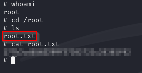

# Kenobi

 

## Escaneo de puertos

Para comenzar, realizaremos un escaneo utilizando **Nmap** con el objetivo de identificar los puertos abiertos en el sistema.

Los puertos detectados en el escaneo son los siguientes:

- **21/TCP** – Servicio FTP (File Transfer Protocol)
- **22/TCP** – Servicio SSH (Secure Shell)
- **80/TCP** – Servicio HTTP (HyperText Transfer Protocol)
- **111/TCP** – Servicio rpcbind
- **139/TCP** – Servicio NetBIOS-SSN
- **445/TCP** – Servicio Microsoft-DS (Server Message Block - SMB)
- **2049/TCP** – Servicio NFS (Network File System)

 

## Enumeración de SMB

Para enumerar los recursos compartidos en **SMB**, ejecutamos el siguiente comando en Nmap:

Nos conectamos al recurso compartido de **SMB** como usuario anónimo. Al explorar su contenido, identificamos un archivo llamado *"log.txt"*.

Procedemos a descargar el archivo utilizando el comando **get** y luego examinamos su contenido para identificar información relevante.

Viendo el archivo podemos revelar que el usuario kenobi tiene claves almacenadas en /home/kenobi/.ssh/.

 

## Análisis de RPC

El análisis realizado previamente revela que el puerto **111/TCP** está asociado con el servicio **rpcbind**, el cual gestiona las solicitudes de RPC en el sistema.

Podemos comprobar los sistemas de archivos compartidos a través de **NFS** ejecutando el comando **showmount**, lo que nos permitirá identificar las monturas disponibles en el servidor.

Nos revela que el directorio **/var** está siendo compartido a través de **NFS**, lo que indica que es accesible desde otros sistemas en la red.

 

## Explotación de FTP

Establecemos una conexión con el servicio **FTP** a través del puerto **21** para explorar su contenido y verificar posibles accesos o archivos disponibles.

Procedemos a analizar posibles vulnerabilidades en la versión **ProFTPD 1.3.5**, revisando bases de datos de exploits conocidos y verificando si existen fallos de seguridad explotables en este servicio.

Se ha identificado una vulnerabilidad en el módulo **mod_copy** de **ProFTPD 1.3.5**, que permite copiar archivos sin necesidad de autenticación. Para aprovechar esta debilidad, utilizamos los siguientes comandos con el fin de copiar la clave privada de **kenobi** a un directorio accesible:

Dado que el directorio **/var** está montado a través de **NFS**, podemos acceder al archivo **id_rsa** desde nuestra máquina atacante, lo que nos permite obtener la clave privada de **kenobi** sin restricciones adicionales.

Una vez obtenida la clave privada **id_rsa**, es importante asegurarnos de que tiene los permisos adecuados antes de utilizarla para la autenticación SSH. Primero, localizamos el archivo **id_rsa** en el sistema y, utilizando el comando **chmod**, asignamos los permisos correctos. Luego, con los permisos configurados, ejecutamos el siguiente comando para autenticarnos como **kenobi** a través de SSH:

Ahora buscamos la **flag** dentro del archivo **user.txt**. Utilizamos los siguientes comandos para localizarlo:

 

## Escalada de privilegios

El **bit SUID** permite ejecutar un binario con los permisos del propietario del archivo. Para buscar los binarios con el bit **SUID** habilitado, ejecutamos el siguiente comando:

Hemos identificado el binario **menu**, el cual al ejecutarse presenta tres opciones. Ahora podemos explorar su comportamiento y las opciones disponibles al ejecutarlo. Para ver las opciones, simplemente ejecutamos:

El binario **menu** se ejecuta con el bit **SUID**, lo que significa que se ejecuta con los permisos del propietario del archivo (probablemente **root**). Este binario llama a otros programas, como **curl**, y al hacerlo, esos programas también se ejecutan con permisos elevados. Aprovechamos esto reemplazando **curl** por nuestro propio shell **/bin/sh**.

Para hacerlo, copiamos **/bin/sh** y lo renombramos como **curl**. Luego, le asignamos los permisos correctos y modificamos la variable **PATH** para que busque nuestro archivo **curl** en lugar del original. De esta forma, cuando ejecutemos el binario **/usr/bin/menu**, se utilizará nuestra versión de **/bin/sh**, y como el binario **menu** se ejecuta como **root**, también ejecutará nuestro shell con privilegios de **root**.

Al seleccionar la opción 1 en el menú, obtenemos acceso como **root**. Ahora que tenemos privilegios elevados, podemos proceder a buscar la segunda **flag** en el sistema.

