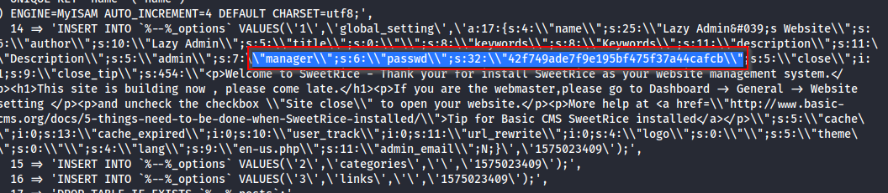
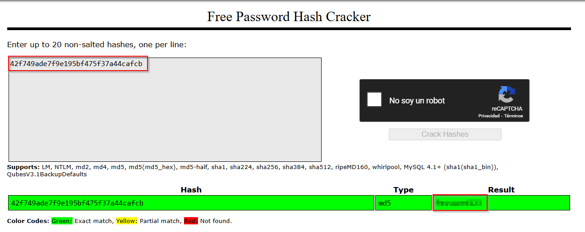

# Lazy Admin

 

## Escaneo de puertos

Como primer paso, realizamos un escaneo de puertos con **Nmap** para identificar los servicios en la máquina.

Los puertos abiertos encontrados son:

- **22/TCP** - SSH
- **80/TCP** - HTTP

Accedemos al navegador e introducimos la **IP** de la máquina seguida del puerto **80**. Al hacerlo, nos encontramos con la **página por defecto de Apache**, que es una página estándar que indica que el servidor web está funcionando correctamente, pero no contiene información adicional por el momento.

Dado que sabemos que hay un servidor web alojado en la máquina virtual, utilizamos `gobuster` para realizar un **scan de directorios ocultos**.

Al realizar el escaneo, descubrimos que el directorio `/content` está disponible. Procedemos a revisarlo para ver qué contenido o archivos podrían estar presentes en esta ubicación, lo que podría proporcionarnos más información o pistas sobre el sistema.

Al explorar el directorio `/content`, descubrimos que tiene instalado un servicio web conocido como **Sweetrice**. Este servicio es conocido por ser un **CMS (Content Management System)**. Con esta información, volvemos a usar `gobuster`, pero esta vez partiendo del directorio `/content` para buscar otros directorios ocultos relacionados con el servicio o el CMS.

Al revisar los directorios `/as` y `/inc`, encontramos un **formulario de inicio de sesión** en uno de ellos, lo que sugiere que el sistema podría estar esperando credenciales para acceder a ciertas funcionalidades. Además, en el directorio `/inc`, descubrimos un conjunto de **archivos** que podrían ser de interés, ya que podrían contener información valiosa o configuraciones relacionadas con el CMS **Sweetrice**.

Al analizar el archivo `mysql_backup`**,** encontramos una entrada que contiene un **usuario** llamado **manager**, seguido de un **hash**. Este hash podría representar la contraseña del usuario **manager**. Si logramos descifrar este hash, es probable que obtengamos la contraseña necesaria para acceder a la cuenta del usuario **manager**.

Una vez que hemos obtenido el **usuario** **manager** y la **contraseña**, los utilizamos para iniciar sesión en el formulario ubicado en el directorio `/as`. Después de acceder al sistema, procedemos a activar la página web haciendo clic en el botón `Running`, lo que podría permitirnos interactuar con el servicio o acceder a funcionalidades adicionales del CMS.

Como sabemos que la versión de SweetRice es la 1.5.1, buscamos un exploit para dicha versión. Encontramos un exploit de tipo Cross-Site Request Forgery que emplea la ejecución de código PHP, por lo tanto lo descargamos.  

Según la información obtenida del archivo del **exploit**, debemos dirigirnos a la pestaña **Ads** en la página web. Una vez allí, subimos un **código PHP malicioso** diseñado para explotarlo, lo que nos permitirá tomar el control de la aplicación o del sistema de alguna manera.

La sección en **PHP** que se nos proporciona será reemplazada por el código que encontramos en **este [repositorio de GitHub](https://github.com/pentestmonkey/php-reverse-shell/blob/master/php-reverse-shell.php)**. En el código, donde aparece `IP`, sustituiremos esa parte con la dirección IP de nuestro host. Esto nos permitirá personalizar el código para que apunte a nuestra máquina y podamos aprovechar la vulnerabilidad de manera efectiva.

A continuación, pulsaremos el botón **DONE** para subir el archivo PHP malicioso. Este archivo se podrá ver en el directorio `/content/inc/ads`. Una vez subido, procedemos a escuchar en el puerto **1234** con **Netcat**, el cual configuramos previamente en el archivo PHP. Es importante asegurarnos de que estamos escuchando en el puerto adecuado antes de ejecutar el archivo, ya que esto nos permitirá recibir una conexión inversa desde la máquina de destino.

Una vez obtenida la shell, la mejoramos para lograr una mayor estabilidad y funcionalidad utilizando el siguiente comando de Python:

Al navegar por el directorio `/home/itguy`, encontramos la primera **flag** dentro del archivo `user.txt`. Este archivo contiene la bandera de usuario, lo que nos confirma que hemos tomado el control exitosamente de la cuenta del usuario **itguy**.

Al ejecutar el comando `sudo -l`, descubrimos que tenemos permisos para **modificar el archivo** `backup.pl` sin necesidad de proporcionar una contraseña. Este tipo de configuración incorrecta nos ofrece una oportunidad para **escalar privilegios** y obtener acceso a funcionalidades de **root**.

 

## Escalada de privilegios

Al examinar el contenido del script en **Perl** mencionado anteriormente, notamos que hace referencia a otro script en **Bash** denominado `copy.sh`. Modificamos este script para incluir código que nos permita obtener una **shell con privilegios de root**, ya que **`copy.sh`** pertenece al usuario **root**. Una vez que hemos realizado la modificación, ejecutamos el script **`copy.sh`** desde el script en Perl, el cual sí podemos ejecutar directamente debido a los permisos que tenemos.

Una vez que hemos obtenido privilegios de **administrador** (root), procedemos a buscar la **última bandera**. Para ello, navegamos al directorio `/root`, donde encontramos el archivo `root.txt`. Este archivo contiene la **bandera de root**, que confirma que hemos escalado correctamente los privilegios hasta el nivel más alto del sistema.

