# Library

El objetivo en esta máquina es obtener acceso, primero como usuario regular y luego como administrador, para leer las flags correspondientes.

El primer paso, como siempre, es ejecutar un escaneo de reconocimiento para identificar los servicios activos en la máquina objetivo.

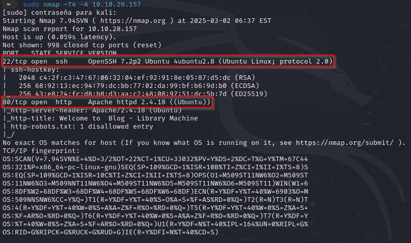

Como se aprecia en la imagen anterior, existen varios servicios que merecen nuestra atención:

- **Puerto 22 (SSH)**: Un servicio SSH abierto sugiere la posibilidad de acceso remoto, ya sea mediante credenciales o explotando alguna vulnerabilidad.
- **Puerto 80 (HTTP)**: Un servidor web en ejecución es una excelente puerta de entrada, ya que puede revelar información, aplicaciones vulnerables o puntos de entrada para la explotación.  

 

## Explorando el servidor web (Puerto 80)

Con el puerto 80 identificado, el siguiente paso es explorar el servidor web. Al acceder a la dirección IP en un navegador, nos encontramos con lo que parece ser un blog.

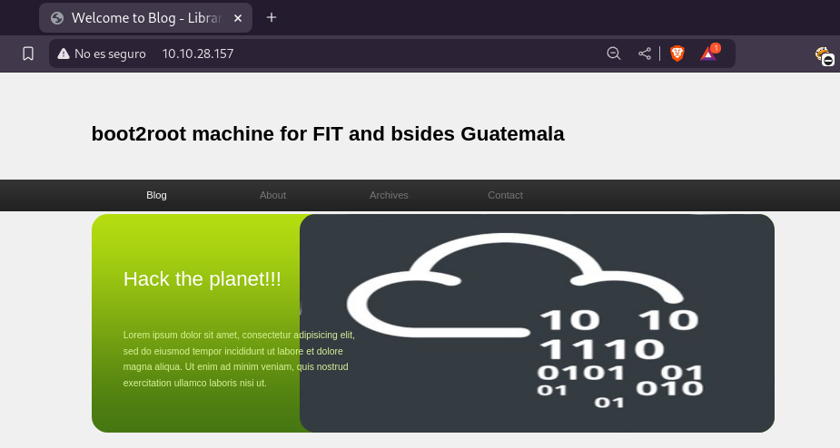

Dedicamos tiempo a navegar por las distintas secciones del blog. En la sección de comentarios, descubrimos interacciones entre los usuarios del sistema, lo que puede revelar nombres de usuario y pistas sobre contraseñas.

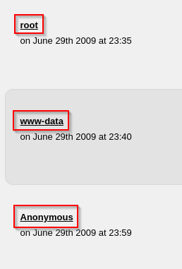

Para ampliar nuestra búsqueda de información, realizamos un *"fuzzeo"* del sitio web.

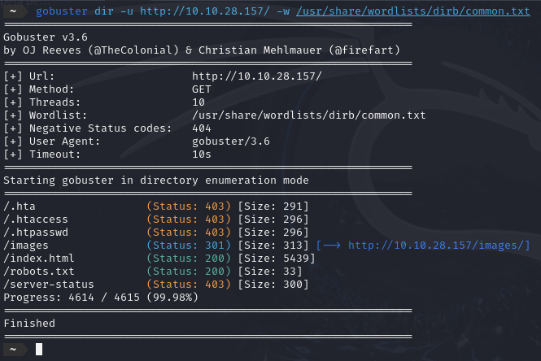

 

## Acceso a través de SSH (Puerto 22)

Basándonos en los usuarios identificados en el blog, mostramos interés en el usuario llamado *"Meliodas"*. La información recopilada sugiere que este usuario es un buen candidato para un ataque de fuerza bruta en el servicio SSH.

A continuación, emplearemos la herramienta Hydra para intentar adivinar la contraseña del usuario **Meliodas** mediante un ataque de fuerza bruta contra el servicio SSH.

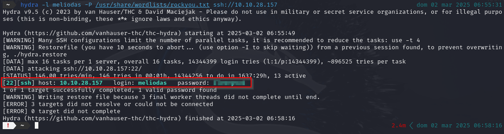

Como se observa en la imagen anterior, Hydra logró encontrar la contraseña del usuario **Meliodas**. Con estas credenciales, podemos acceder al sistema objetivo a través de SSH.

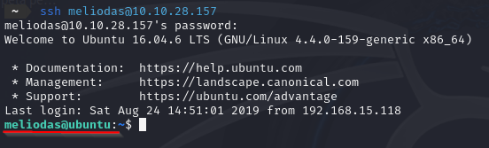

### Obtención de la flag de usuario (user.txt)

Una vez dentro del sistema como el usuario **Meliodas**, exploramos su directorio *"home"* para encontrar la flag de usuario.

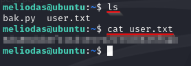

### Escalada de privilegios y flag de root (root.txt)

Para obtener la flag del administrador, es necesario escalar privilegios en el sistema objetivo. Comenzamos examinando qué comandos puede ejecutar el usuario **Meliodas** como administrador utilizando el comando *sudo -l*.

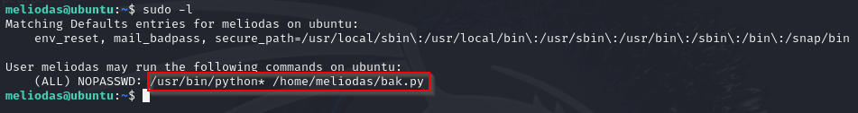

La imagen anterior revela que el usuario **Meliodas** puede ejecutar el comando *"python"* y el archivo *"bak.py"* como administrador.

Listamos los archivos en el directorio *"home"* del usuario para verificar la existencia del archivo *"bak.py"*. Para poder editarlo, crearemos una copia, ya que el sistema no permitirá ingresarle líneas de comandos.

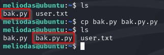

Eliminamos el archivo original y le ponemos el nombre al nuevo fichero para proceder a inyectarle el payload.

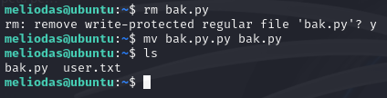

Ahora, utilizaremos el comando *"echo"* para insertar un payload que nos proporcionará una shell cuando se ejecute el archivo *"bak.py"* como administrador.

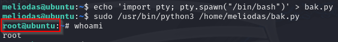

Por último, navegamos al directorio *"/root"* para buscar y mostrar la flag de administrador.

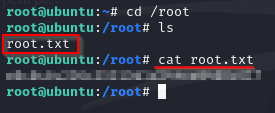
