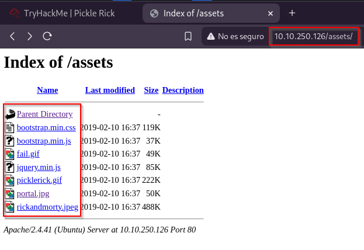

# Pickle Rick

 

## Escaneo de puertos

El primer paso del análisis es usar **Nmap** para identificar el sistema operativo y los puertos abiertos.

El siguiente paso es usar **Gobuster** para explorar la estructura de la web.

En la carpeta "*assets*" se encuentran los siguientes archivos:

Otra forma de analizar la web es ingresando y usando la opción de "*Inspeccionar elemento*", donde podemos encontrar un nombre de usuario que podría ser útil más adelante.

El siguiente paso es buscar archivos comunes que suelen estar desprotegidos, como "*robots.txt*". En este caso, dentro de ese archivo se encontró lo que podría ser la contraseña del usuario identificado anteriormente.

Usando **Gobuster**, encontramos un archivo "*login.php*". Con el usuario y la contraseña descubiertos antes, podemos intentar iniciar sesión en él.

 

## Búsqueda de ingredientes

Al iniciar sesión, aparece una línea de comandos. Si ejecutamos "*ls"*, podemos ver los archivos disponibles en el sistema.

Si revisamos el primer archivo que aparece, encontramos el primer ingrediente.

Al ejecutar el comando "*sudo -l*" vemos que podemos usar **sudo** para ejecutar comandos como cualquier usuario.

Esto nos indica que debemos revisar el sistema de archivos. En el "Panel de Comandos", que funciona como una terminal de Linux, el directorio más importante para revisar es **/home**, donde encontramos los directorios de los usuarios. Al ejecutar "*ls /home"*, vemos dos directorios: **rick** y **ubuntu**.

El directorio "**ubuntu**" parece ser el predeterminado del sistema, pero "**rick**" es claramente un usuario configurado. Al listar el contenido de "**/home/rick**" con "*ls /home/rick"*, encontramos un archivo interesante.

Hemos encontrado el segundo ingrediente. Para ver el contenido de este archivo, usamos el comando **tac** seguido de la ruta completa: "*tac /home/rick/second\\ ingredientes"* (la barra invertida es necesaria por el espacio en el nombre del archivo).

Solo queda un ingrediente/bandera, pero no sabemos dónde está. Por lo tanto, podemos asumir que es la "bandera raíz", lo que requerirá escalar privilegios para convertirnos en el usuario raíz.

Si ejecutamos el comando "*whoami"* en el Panel de Comandos, veremos que **actualmente estamos como “www-data”**, un usuario que no tiene acceso al directorio “/root/”.

Luego, usamos "*sudo -l"* para ver los permisos del usuario. Si aparece que **www-data** puede ejecutar cualquier comando como root sin contraseña, solo debemos agregar **sudo** antes del comando que queramos usar para acceder a los archivos.

Entonces, al listar todo el contenido del directorio “/root/” con el prefijo “sudo”, podemos ver una lista de archivos, uno de los cuales tiene un nombre de “3rd.txt”.

Ahora, para ver el contenido, usaremos nuevamente el comando **tac** como lo hicimos antes:

