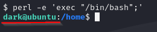
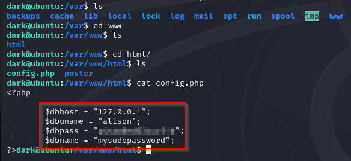

# Poster

 

## Escaneo de puertos

Realizaremos un análisis inicial de la máquina objetivo utilizando **Nmap** para identificar puertos abiertos y servicios en ejecución.

Los puertos que se encuentran abiertos son:

- **80/TCP** - HTTP
- **22/TCP** - SSH
- **5432/TCP** - PostgreSQL

 

## Enumeración de credenciales 

Una vez identificado que el puerto **5432** está abierto y ejecutando un servicio de **PostgreSQL**, procedemos a utilizar **Metasploit** para comprobar si es posible autenticarse en la base de datos con credenciales por defecto o débiles.

Para ello, utilizamos el módulo auxiliar: `auxiliary/scanner/postgres/postgres_login`

Configuramos y ejecutamos el exploit 

Utilizamos el módulo `auxiliary/admin/postgres/postgres_login` de Metasploit para intentar autenticarnos en el servicio PostgreSQL. Este módulo permite probar credenciales comunes o débiles directamente sobre un objetivo específico. Si el acceso es exitoso, podremos interactuar con la base de datos y avanzar en la explotación.

A continuación, revisamos las opciones requeridas por el módulo para asegurarnos de que todos los parámetros necesarios estén correctamente configurados antes de ejecutarlo.

Configuramos el exploit con las credenciales obtenidas en el paso anterior y añadiendo nuestra máquina objetivo.

Una vez terminada la configuración, corremos el exploit y tendremos la versión del servicio.

Utilizamos el módulo `auxiliary/scanner/postgres/postgres_hashdump` con el objetivo de volcar los hashes de las contraseñas almacenadas en la base de datos. Este módulo permite extraer los hashes de los usuarios PostgreSQL, lo cual puede facilitar futuros ataques de fuerza bruta o descifrado offline.

Volvemos a configurar los elementos igual que el anterior exploit.

Cuando ejecutamos el exploit encontramos hashes de **6** usuarios.

El módulo utilizado para leer archivos en el sistema es `auxiliary/admin/postgres/postgres_readfile`, el cual permite acceder a archivos específicos en el servidor PostgreSQL con las credenciales adecuadas.

Por otro lado, el módulo `exploit/multi/postgres/postgres_copy_from_program_cmd_exec` posibilita la ejecución de comandos arbitrarios a través de PostgreSQL, siempre que tengamos las credenciales de usuario correctas.

En este caso, usaremos `auxiliary/admin/postgres/postgres_readfile` para leer la bandera y obtener la información requerida.

Deberemos de configurarlo de la misma manera que los anteriores

Y corremos el exploit 

Existe un archivo denominado **credentials.txt** ubicado en `/home/dark`. Ahora, procederemos a configurar el parámetro RFILE con la ruta de este archivo para leer su contenido utilizando el módulo **postgres_readfile**.

Una vez obtenida la contraseña del usuario **dark**, procederemos a conectarnos a la máquina de forma remota a través de SSH utilizando las credenciales correspondientes.

Una vez dentro del sistema, para garantizar una mayor estabilidad y acceso persistente, creamos una consola **bash** utilizando Perl.

A continuación, nos desplazamos por el sistema en busca de la bandera, buscando archivos relevantes que puedan contener la información necesaria.

El **archivo user.txt** se encuentra en el directorio de inicio de **Alison**, pero aún no podemos acceder a él, ya que solo **Alison** tiene permisos para leerlo.

Por lo tanto, realizamos una búsqueda para identificar todos los archivos propiedad de **Alison** y verificar si hay alguna forma de obtener acceso a ellos.

Hemos identificado un archivo llamado **config.php**. Procedemos a verificar si tenemos permisos para leerlo y si contiene información útil para avanzar en nuestra explotación.

Una vez obtenida la contraseña de **Alison**, podemos proceder a acceder a su cuenta y continuar con la búsqueda de la bandera.

Ahora que tenemos la contraseña de **Alison**, procedemos a acceder a la raíz en busca de la bandera final. Primero, verificamos si **Alison** tiene privilegios para ejecutar **sudo**, lo cual nos permitiría obtener acceso elevado al sistema.

Dado que **Alison** tiene permisos para ejecutar cualquier comando como **sudo**, podemos aprovechar esta capacidad para obtener acceso root y, obtener la bandera de root.

