# Relevant

 

## Escaneo de puertos

Como primer paso, realizamos un escaneo de puertos con **Nmap** para identificar los servicios en la máquina.

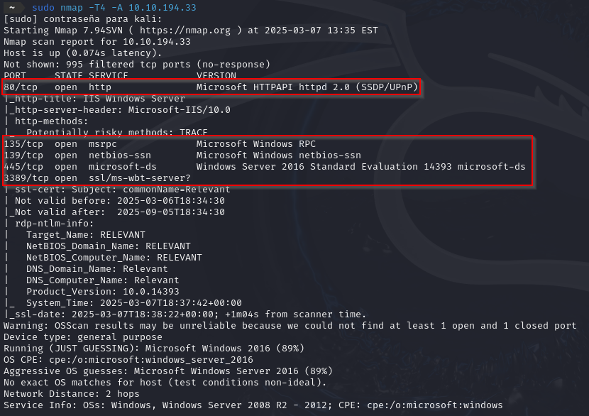

Posteriormente, ejecutamos un escaneo más detallado sobre el puerto **445** (SMB) utilizando los scripts "*smb-enum-shares.nse*" y "*smb-enum-users.nse*" para enumerar los recursos compartidos y usuarios disponibles.

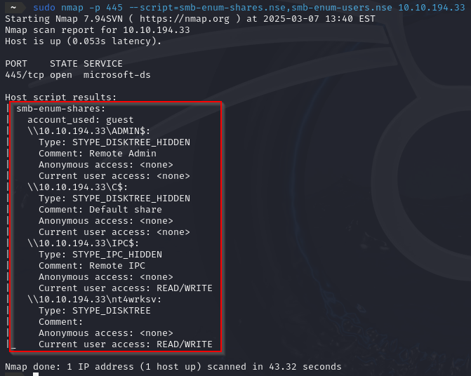

## Enumeración con enum4linux

A continuación, empleamos la herramienta **Enum4linux** para recopilar información detallada sobre la configuración y estructura del sistema objetivo.

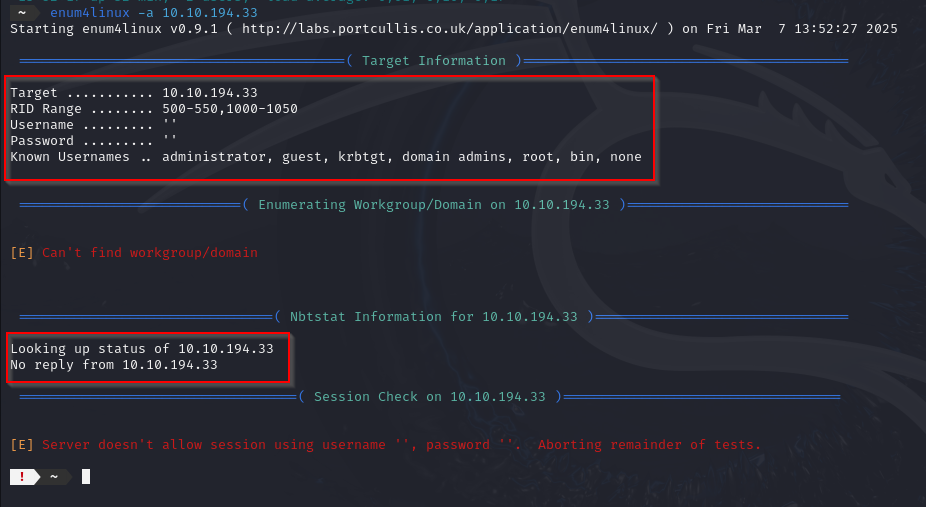

 

## Enumeración de SMB

Utilizamos el protocolo SMB para explorar los recursos compartidos mediante los comandos: "*smbap*" y "*smbclient*"

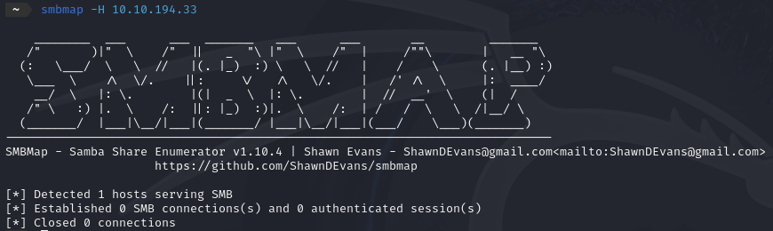

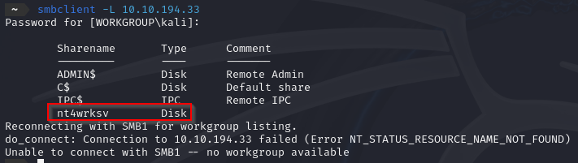

Identificamos un usuario con acceso y descargamos el archivo "*password.txt*".

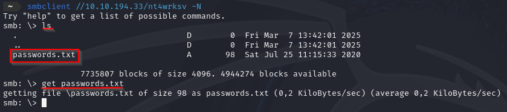

Contenido del archivo:

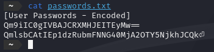

Las credenciales encontradas están codificadas en *Base64*. Utilizamos la herramienta **CyberChef** para su decodificación.

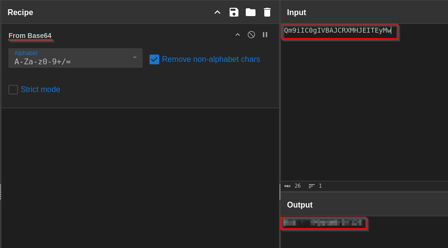

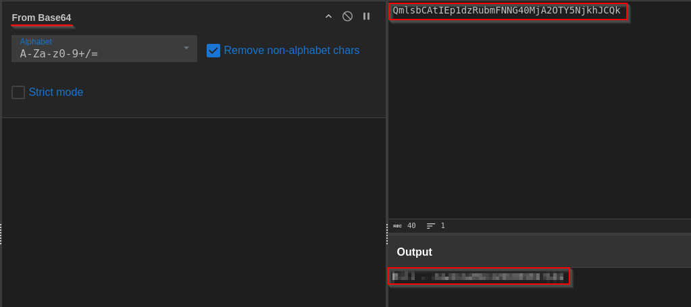

 

## Escalada de privilegios 

Generamos una reverse shell en **ASPX** para cargarla en el servidor y obtener acceso remoto.

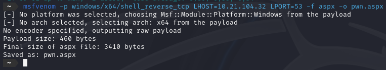

Subimos el archivo y establecemos conexión con la reverse shell.

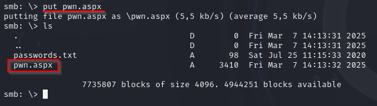

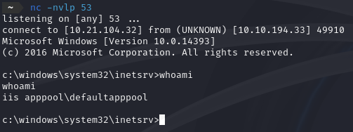

Identificamos y obtenemos la primera flag ubicada en el archivo "*user.txt*".

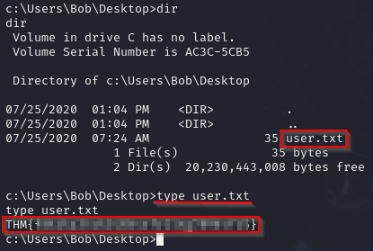

Verificamos los privilegios disponibles en la sesión y encontramos la vulnerabilidad "*SeImpersonatePrivilege*", la cual nos permite explotar un método conocido.

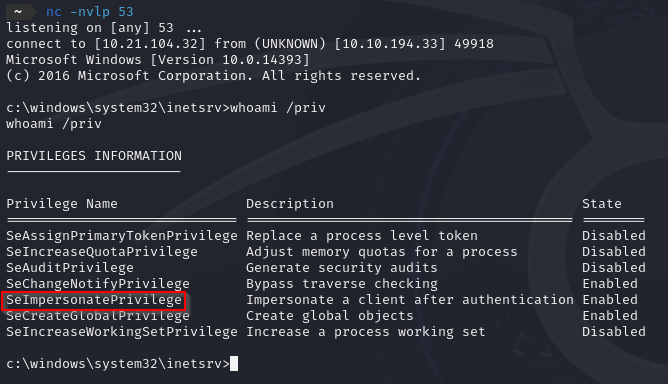

Para explotarlo, clonamos el siguiente repositorio que contiene el exploit necesario:

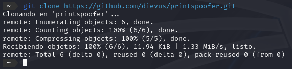

Y subimos el siguiente .exe al servidor:

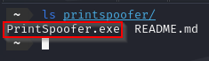

Para que se encuentre correctamente el archivo debemos de ejecutar el **smbclient** desde la carpeta **printspoofer**, y ya una vez dentro podemos subirlo.

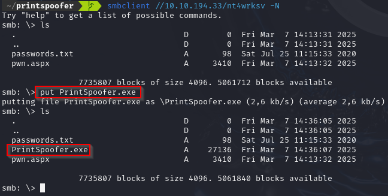

Ejecutamos el exploit y obtenemos acceso como **NT AUTHORITY\\SYSTEM**.

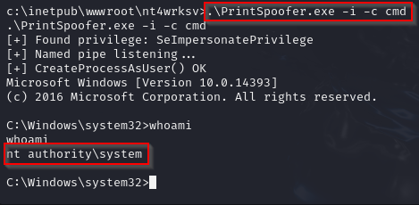

Una vez con privilegios de administrador, localizamos el archivo "*root.txt*" y obtenemos nuestra segunda flag.

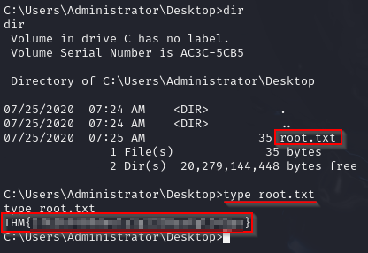