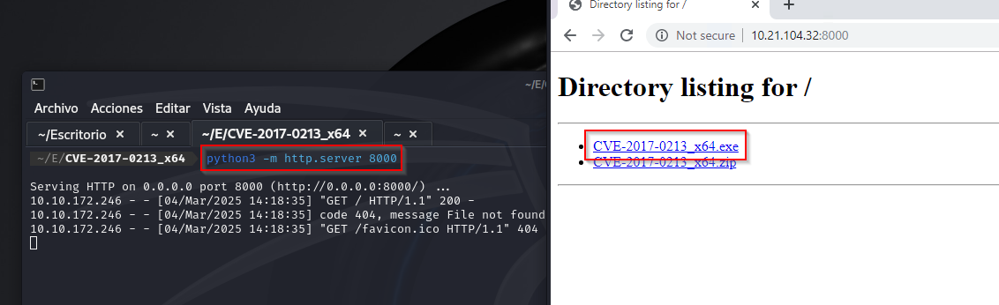

# Retro

La máquina **Retro** presenta una estructura similar a la de *Blaster*, con la diferencia de que no proporciona una guía detallada en su resolución. La explotación sigue un camino parecido, con algunas variaciones en la escala de privilegios.

 

## Escaneo de puertos

Se inicia con un escaneo de puertos de la máquina objetivo, empleando el parámetro "*\-Pn*", dado que no responde a pings.

Al analizar el puerto *80*, encontramos el index por defecto de **Microsoft IIS**. 

 

## Investigación de la página

Se realiza un fuzzing de directorios y se identifica */retro*, un blog personal de Wade con contenido sobre videojuegos, películas y otros temas de interés.

En el blog, un post sobre **Ready Player One** revela un posible error recurrente del usuario al escribir el nombre de su avatar. Revisando los comentarios, se obtiene una *contraseña*.

Con las credenciales en mano, intentamos acceder al sistema utilizando la herramienta **xfreerdp**.

Al lograr la conexión, encontramos el archivo "*user.txt*", que contiene la primera flag. En la papelera de reciclaje, se identifica el ejecutable "*hhupd.exe*", que permitirá la escalada de privilegios.

Dentro del *"user.txt"* encontraremos la primera flag

Como lo dijimos en la máquina *blaster* el ejecutable esta asociado al **CVE-2019-1388**, de todas maneras investigando un poco podemos encontrar dentro del google chrome en el apartado de marcadores lo siguiente:  

 

## Escalada de privilegios

El ejecutable está vinculado a la vulnerabilidad **CVE-2019-1388**. No obstante, al intentar explotarla, surge un error que impide el uso de Google Chrome o Internet Explorer para continuar. Investigando, se encuentra que esto es un bug del sistema Windows Server.

Realizamos los mismos pasos que en la máquina *blaster*, pero con la excepción del bug.

En este punto, deberíamos seguir los pasos que hicimos en la room de *Blaster*, pero aparece lo siguiente:

Para solventarlo, se busca una alternativa y se identifica la vulnerabilidad [CVE-2017-0213](https://cve.mitre.org/cgi-bin/cvename.cgi?name=CVE-2017-0213), que permite la escalada de privilegios mediante la ejecución de una aplicación específica.

Se descarga el exploit correspondiente desde este [repositorio](https://github.com/WindowsExploits/Exploits/tree/master/CVE-2017-0213). Dado que Windows clasifica el archivo como potencialmente peligroso, es necesario autorizar su descarga de manera manual. Tras completarla, se procede a descomprimirlo y transferirlo a la máquina objetivo utilizando Python.

Una vez descargado el archivo, procederemos a ejecutarlo y, como podemos observar en la imagen, nos encontramos en la interfaz de administrador.  

Finalmente, navegando entre los directorios, se localiza "*root.txt*", completando así la explotación de la máquina Retro.

