# RootMe

 

## Escaneo de puertos

Para comenzar, realizaremos un escaneo utilizando **Nmap** con el objetivo de identificar los puertos abiertos en el sistema.

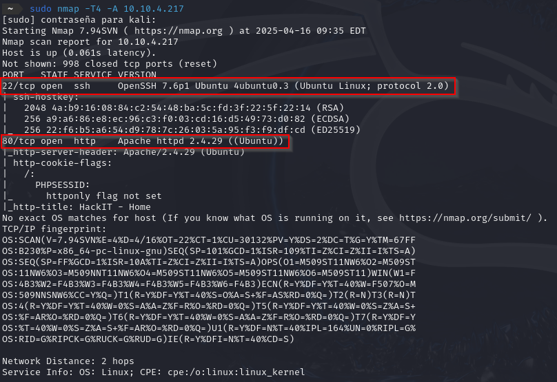

Como podemos observar en la imagen los puertos abiertos son:

- **80/TCP -** HTTP
- **22/TCP -** SSH  

 

Ahora utilizaremos la herramienta **Gobuster** para realizar una exploración de directorios en el servidor web, con el objetivo de identificar rutas ocultas que no están visibles directamente desde la página principal.

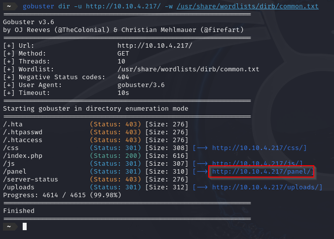

Una vez identificado el directorio oculto (`/panel/`), procedemos a acceder a él. Dentro de esta sección, se nos proporciona la opción de cargar archivos en el servidor.

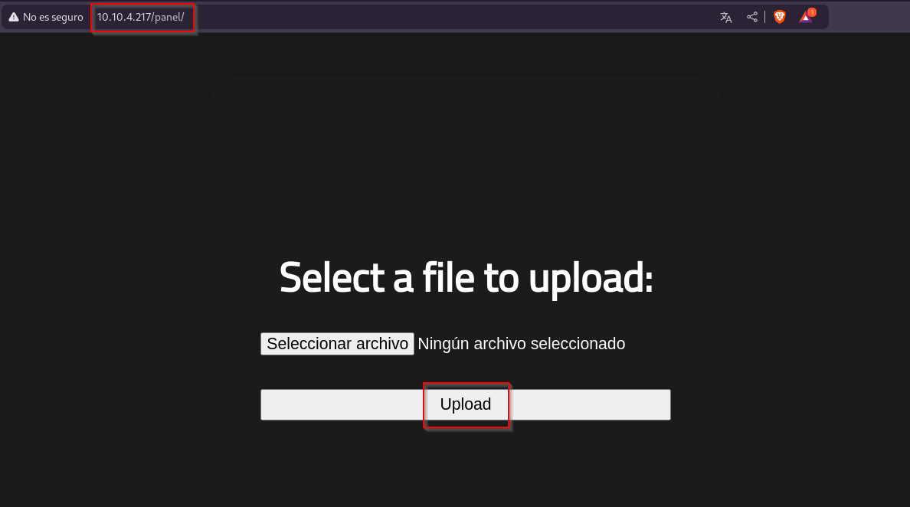

El siguiente paso consiste en generar una *reverse shell* en PHP, configurando en ella nuestra dirección IP y el puerto que utilizaremos para la escucha. Sin embargo, al intentar subir este archivo al servidor, notamos que el sistema no permite su carga directamente.

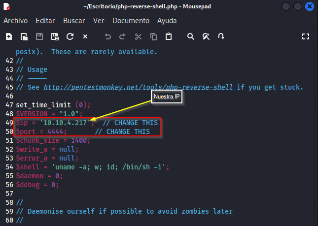

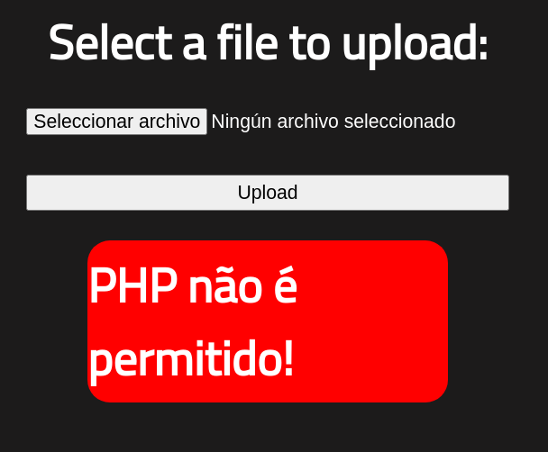

Para sortear las restricciones del servidor y lograr que acepte el archivo, modificamos la extensión de nuestra *reverse shell* de `.php` a `.phtml`. Con este cambio, el archivo puede subirse sin inconvenientes.

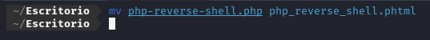

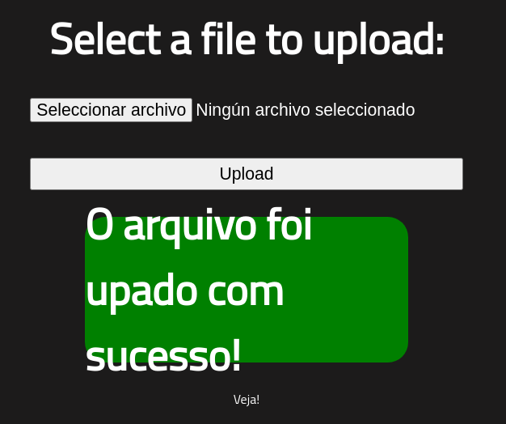

Una vez completada la carga del archivo, procedemos a iniciar un proceso de escucha utilizando **Netcat** en el puerto previamente configurado.

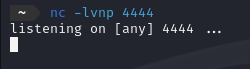

Simultáneamente, ejecutamos el script haciendo doble clic sobre él, ubicado en el directorio de *uploads*.

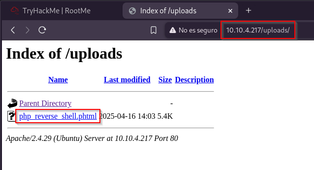

Tras la ejecución, el sistema debería establecer una *reverse shell* estable. Para garantizar su estabilidad, procedemos a ejecutar el siguiente comando:

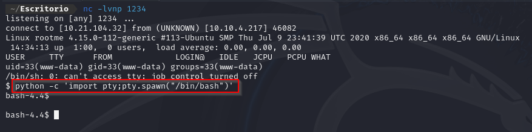

A continuación, procederemos a la búsqueda de la *flag*. Para ello, nuestro objetivo es localizar el archivo `user.txt`.

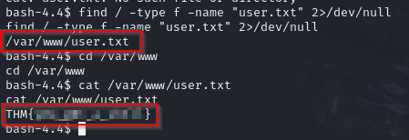

A continuación, ejecutaremos el siguiente comando para revisar los permisos relevantes. Al hacerlo, observamos que existe un archivo en el directorio `/usr/bin/python` que no pertenece al sistema.

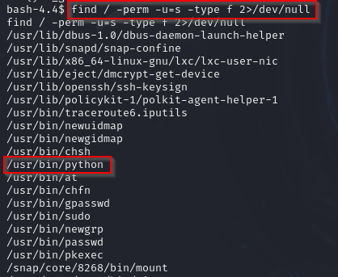

 

## Escalada de privilegios

Para realizar la escalada de privilegios, podemos consultar la página de [<ins>GTFOBins</ins>](https://gtfobins.github.io/gtfobins/python/#reverse-shell) en busca de posibles comandos de escalada para Python. El comando que utilizaremos es el siguiente:

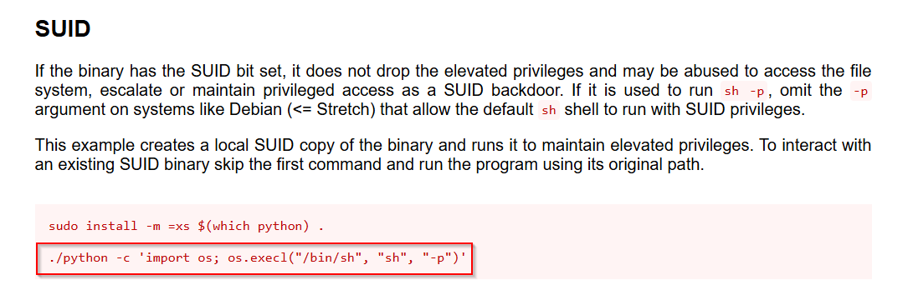

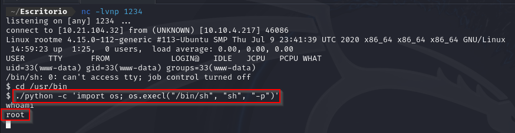

Por último, procederemos de la misma manera que lo hicimos con el archivo `user.txt`, pero en este caso buscaremos el archivo `root.txt`.

