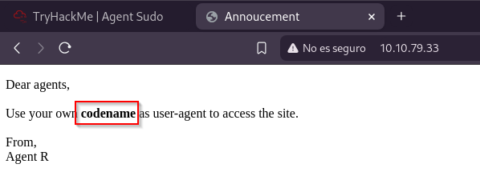

# Sudo Agent

 

## Escaneo de puertos

El análisis comienza ejecutando un escaneo con **Nmap**, con el objetivo de identificar los puertos abiertos en la máquina y obtener información sobre el sistema operativo que se encuentran.

El escaneo revela que los puertos están abiertos son:

- **80/TCP -** HTTP
- **21/TCP -** FTP
- **22/TCP -** SSH  
     

Como primer paso, accedemos al sitio web objetivo y observamos el siguiente mensaje en pantalla:

El mensaje sugiere que, para acceder correctamente al sitio, es necesario personalizar el valor del encabezado **User-Agent**, utilizando un identificador específico. En este caso, se nos indica que utilicemos nuestro propio "código", firmado como **Agente R**.

Como primera prueba, se procede a establecer el **User-Agent** como `"R"` al realizar la solicitud al sitio.

Se realizan múltiples solicitudes utilizando diferentes valores en el encabezado **User-Agent** a través de la herramienta `curl`. Como resultado de estas pruebas, se obtiene una nueva respuesta del servidor al utilizar `"C"` como **User-Agent**, lo que indica un posible cambio en el comportamiento del sitio según el agente utilizado.

Como siguiente paso en el proceso de enumeración, se intenta obtener la contraseña del usuario identificado mediante un ataque de fuerza bruta. Para ello, se utiliza la herramienta **Hydra**, aprovechando su capacidad para automatizar intentos de autenticación contra el servicio expuesto.

Una vez obtenidas las credenciales válidas, se establece una conexión con el servidor a través del protocolo **FTP**. Procedemos a listar y descargar todos los archivos disponibles, con el objetivo de analizarlos localmente en busca de información relevante.

A continuación, se examina el contenido de uno de los archivos obtenidos.

En el siguiente paso, se procede a inspeccionar posibles datos ocultos dentro de archivos de imagen utilizando herramientas especializadas. En esta ocasión, se emplea **binwalk** para analizar el archivo **cutie.png**. El resultado revela que la imagen contiene un archivo comprimido en formato **ZIP** incrustado en su estructura.

Se procede a extraer el archivo ZIP oculto dentro de la imagen utilizando **binwalk**. Sin embargo, al intentar acceder a su contenido, se detecta que el archivo está protegido por contraseña. Para intentar recuperarla, se recurre a un ataque de fuerza bruta utilizando la herramienta **John the Ripper**, que permite descifrar contraseñas a partir de hashes obtenidos del archivo.

El proceso comienza utilizando la herramienta **zip2john** para convertir el archivo ZIP en un formato compatible con **John the Ripper**, generando así el hash necesario para el ataque. Una vez obtenido, se utiliza **john** para intentar descifrar el contenido protegido del archivo.

Una vez que se ha logrado descifrar la contraseña, se procede a descomprimir el archivo ZIP y acceder a su contenido. Dentro de él, se encuentra un archivo de texto que contiene un mensaje directo del **Agente R**, el cual podría ser crucial para avanzar en el análisis.

Utilizando la contraseña obtenida, se procede a recuperar la información oculta en otra imagen, **cute-alien.jpg**. Gracias a este procedimiento, se logran extraer credenciales válidas correspondientes a un usuario denominado **james**.

Con las credenciales obtenidas de **james**, se establece una conexión remota a la máquina a través del servicio **SSH**.

 

## Primera flag

Una vez dentro del sistema a través de la conexión SSH, se realiza una navegación por el directorio del usuario y se localiza el archivo **user_flag.txt**, en el cual se encuentra la **flag** correspondiente.

Al realizar una búsqueda, descubrimos que el nombre del incidente relacionado con la imagen es **Roswell Alien Autopsy**.

 

## Escalada de privilegios

Lo primero que vamos a ver es que permisos tiene el usuario james con el comando \`**sudo -l**\`.

Buscando tal cual ‘**(ALL, !root) /bin/bash**’ encontramos esta [<ins>**vulnerabilidad**</ins>](https://www.exploit-db.com/exploits/47502) . Para realizar la escalada utilizamos el siguiente comando: `sudo -u#-1 /bin/bash`

