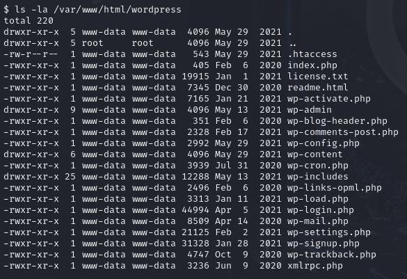

# Tech_Supp0rt1

 

## Reconocimiento y escaneo

El primer paso en el análisis de la máquina consistió en realizar un escaneo de puertos con **Nmap**.

Los resultados indicaron la presencia de varios servicios activos:

- 22/TCP (**SSH**)
- 80/TCP (**HTTP**)
- 139/TCP (**SMB**)
- 445/TCP (**SMB**)  

 

Dado que el protocolo **SMB** estaba disponible, se utilizó el script "*smb-enum-shares"* de Nmap para enumerar los recursos compartidos, revelando que existía un directorio accesible llamado **websvr**. Este directorio permitía el acceso anónimo con permisos de lectura y escritura.

La obtención de acceso a este directorio se logra mediante el establecimiento de una sesión **anonymous**.

Al conectar al recurso compartido, se identificó un archivo denominado "*enter.txt*".

Tras descargarlo y analizar su contenido, se descubrió información relevante sobre credenciales potenciales y la existencia de dos sitios web en el servidor: uno basado en **WordPress** y otro en **Subrion** CMS.

Con la información obtenida en la fase de reconocimiento, accedemos al portal de administración del CMS **Subrion**.

Sin embargo, la contraseña obtenida en el archivo "*enter.txt*" estaba codificada. Utilizando la herramienta **CyberChef**, se logró descifrar la contraseña, lo que permitió autenticarse en el panel de control del CMS.

Ahora ingresamos las credenciales obtenidas previamente para acceder al panel de control del **CMS**.

Dentro del entorno de administración de **Subrion**, detectamos una funcionalidad que permitía la subida de archivos

Hay dos posibles opciones de explotación: intentar cargar una **reverse** shell o buscar un **exploit** específico para la versión del CMS en uso. Optando por la segunda opción, se localizó un exploit en Python

A continuación lo descargaremos y ejecutaremos con éxito, proporcionando acceso al sistema.

A partir de ahí, se realizó una exploración del servidor y se identificaron archivos críticos dentro del directorio de WordPress, incluyendo el **wp-config.php,** que contenía credenciales adicionales.

 

## Escalada de privilegios.

Tras la identificación de las credenciales en los archivos de configuración, procedemos a ejecutar el siguiente comando:

Se identificó un nuevo usuario denominado "**scamsite**". Procedemos a intentar establecer una conexión *SSH* utilizando las credenciales previamente obtenidas.

Procedemos a enumerar los comandos que el usuario "**scamsite**" tiene permiso para ejecutar con privilegios elevados:

Como vemos en la imagen anterior se identificó que tenía permisos para ejecutar el binario **iconv** con privilegios elevados.

Procedemos a consultar la página de [GTFOBins](https://gtfobins.github.io/gtfobins/iconv/#sudo), para verificar si existe un método que nos permita escalar privilegios aprovechando este binario. 

La página nos muestra un comando que permite asignar el archivo en la variable "*file*".

Nuestro siguiente paso, será intentar leer el archivo "*root.txt"* para que el sistema nos revele la flag que necesitamos.

