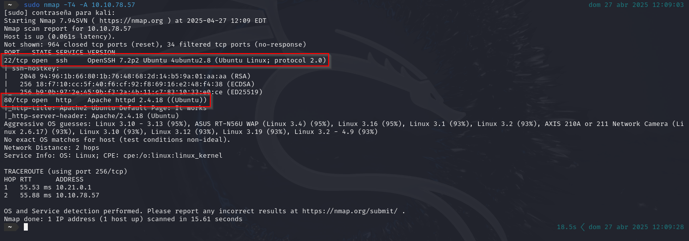

# Wgel CTF

 

## Escaneo de puertos

El análisis comienza ejecutando un escaneo con **Nmap**, con el objetivo de identificar los puertos abiertos en la máquina y obtener información sobre el sistema operativo que se encuentran.

Los puertos abiertos son:

- **22/TCP** - SSH
- **80/TCP** - HTTP

 

## Analizando la web

Al visitar el sitio web, observamos que se muestra la **página predeterminada de Apache2 en Ubuntu**, aunque resulta curioso que presenta un **espacio en blanco inusual al final**, lo que podría indicar una posible modificación.

Como podemos apreciar, existe un **espacio en blanco** al final de la página. Al inspeccionar el código fuente, encontramos un **comentario oculto** que dice:

> *"Jessie, no olvides actualizar el sitio web."*

A partir del comentario encontrado, deducimos que el **nombre de usuario** es probablemente `jessie`.

A continuación, utilizamos **Gobuster** para realizar una enumeración de directorios en el sitio web, con el objetivo de descubrir rutas ocultas o recursos sensibles que puedan ser explotados.

Vemos la página pero no encontramos nada relevante.

Así que volvemos a utilizar la herramienta gobuster, pero esta vez a través del directorio encontrado.

Durante la enumeración, identificamos la existencia del directorio `/.ssh` accediendo a la ruta \[`http://IP/sitemap/.ssh`\].

Dentro de este directorio, encontramos una **clave privada RSA**. Procedemos a **copiar el contenido de la clave** y **guardarlo en un archivo local** en nuestra máquina, asegurándonos de **cambiar los permisos** del archivo con el comando:

`chmod 600 id_rsa`

Ahora utilizaremos esta **clave privada** para intentar establecer una **conexión SSH** con la máquina de destino.

Una vez dentro de la máquina, nos dirigimos al directorio `Documentos` del usuario comprometido. Allí buscamos el archivo `user_flag.txt`, el cual contiene la **primera bandera de usuario** que necesitamos capturar.

 

## Escalada de privilegios

Ahora exploramos las posibilidades de escalada de privilegios. Verificamos que el usuario **Jessie** puede ejecutar comandos como **root**. Para confirmar esto, utilizamos el siguiente comando:

Para obtener la **segunda bandera**, utilizamos `wget` con el parámetro `--post-file`, especificando la ruta del archivo que contiene la bandera y la dirección IP de nuestra máquina local a la que queremos enviar el archivo.  

Además, configuramos un **listener** con **Netcat** en **el puerto 8080** para recibir el archivo enviado por la máquina objetivo.

Y ya tendríamos nuestra segunda flag.

* * *

 

Existe otra manera de poder escalar los privilegios y obtener una root shell.

Al revisar los privilegios de **Jessie**, observamos que tiene permisos para ejecutar `/usr/bin/wget` como **root**. Aprovechamos esta configuración incorrecta para nuestra ventaja.

Usamos `wget` para transferir el contenido del archivo `/etc/passwd` desde la máquina de destino a nuestra máquina local. Este archivo contiene información valiosa sobre los usuarios del sistema. Después de transferirlo, crearemos un nuevo archivo `passwd` y lo devolveremos a la máquina de destino para modificar el sistema.

Primero, establecemos un **listener** con **Netcat** en un puerto específico (por ejemplo, **puerto 8080**) para recibir el archivo:

Una vez que **Netcat** haya recibido el contenido de `/etc/passwd` en nuestra máquina local, copiamos los datos y los pegamos en un nuevo archivo llamado `passwd`.

A continuación, modificamos la entrada correspondiente al usuario **root**. En lugar de dejar la `x` en el campo de la contraseña, reemplazamos esa `x` por la **contraseña mágica**:  
**U6aMy0wojraho**.

Esto es posible porque la `x` en el archivo `/etc/passwd` indica que la contraseña real está almacenada en el archivo `/etc/shadow`. Al realizar este cambio, conseguimos que la contraseña **U6aMy0wojraho** sea reconocida como la contraseña del usuario **root**, lo que nos permitirá iniciar sesión sin necesidad de ingresar ninguna contraseña (simplemente presionando **Enter**).

Para transferir el archivo `passwd` modificado de vuelta al sistema de destino, creamos un **servidor HTTP simple** en nuestra máquina local utilizando **Python**. Esto nos permitirá alojar el archivo y permitir que la máquina comprometida lo descargue fácilmente.

Una vez que el servidor HTTP esté en funcionamiento en nuestra máquina local, utilizamos `wget` en la máquina de destino para descargar el archivo `passwd` modificado. Reemplazamos el archivo `/etc/passwd` de la máquina de destino con el archivo descargado utilizando el siguiente comando:

Una vez reemplazado el archivo `/etc/passwd`, cambiamos al usuario **root**.

Cuando se nos solicite la contraseña, simplemente presionamos **Enter**, ya que hemos configurado la **contraseña mágica** en el archivo `passwd`.

A continuación, navegamos al directorio `/root` y ejecutamos el comando para leer el archivo `root_flag.txt`, obteniendo así la **bandera final** de root:

